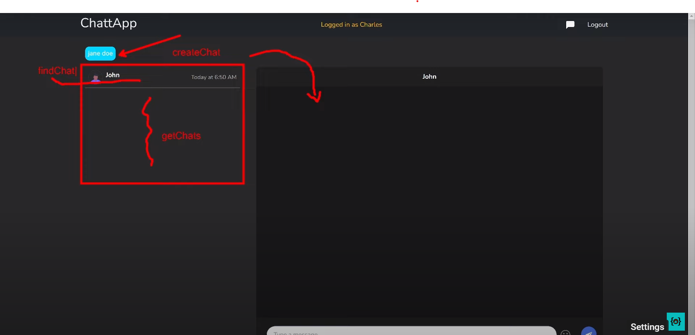
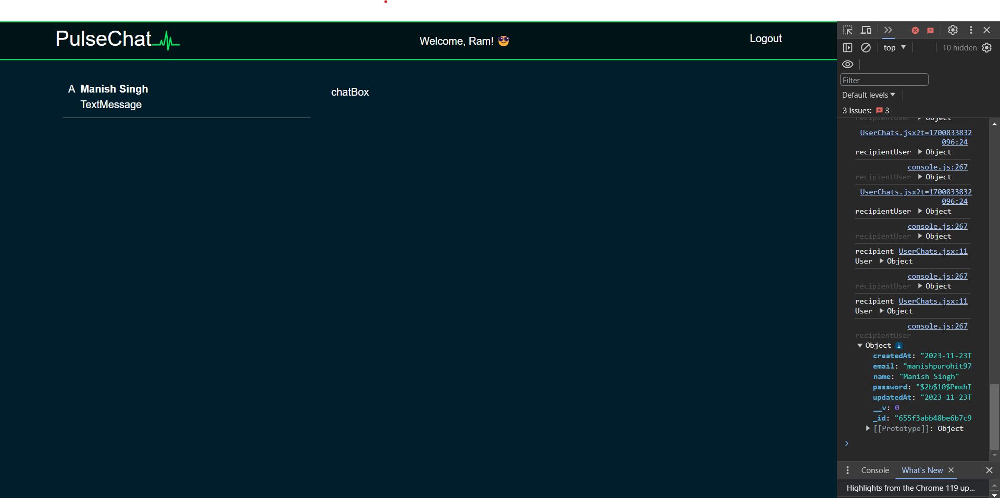
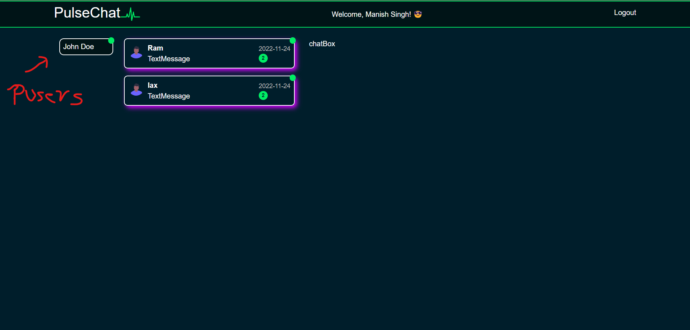
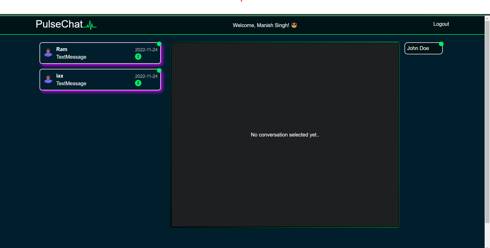
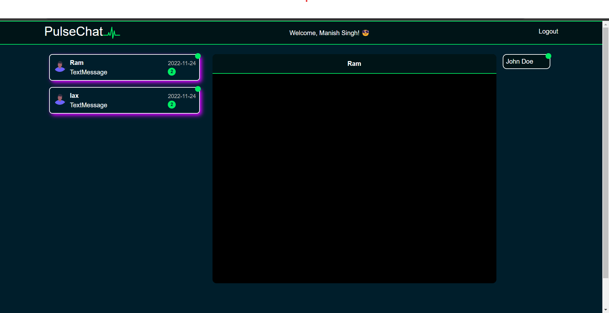
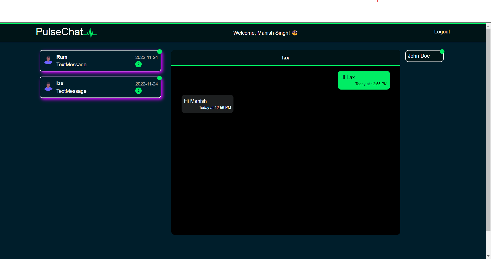

## Server

1. Create a `server` folder.

    ```bash
    ..\chat-app\server> npm init
    ```

    Follow the prompts during the initialization:

    - **Package name:** (server)
    - **Version:** (1.0.0)
    - **Description:** [Your description here]
    - **Entry point:** (index.js)
    - **Test command:**
    - **Git repository:**
    - **Keywords:**
    - **Author:**
    - **License:** (ISC)

2. Create an `index.js` file in the `server` folder.

3. Install the required libraries:

    ```bash
    npm i express mongoose cors dotenv
    ```

4. To run `index.js` continuously in development mode (automatically restarting when you save changes), install `nodemon`:

    ```bash
    npm i nodemon
    ```


//package.json

```json
{
  "name": "server",
  "version": "1.0.0",
  "description": "First server side coding then client",
  "main": "index.js",
  "scripts": {
    "test": "echo \"Error: no test specified\" && exit 1",
    "start": "node index.js", //Changes made
    "dev": "nodemon index.js" //Changes made
  },
  "author": "Manish Singh",
  "license": "ISC",
  "dependencies": {
    "cors": "^2.8.5",
    "express": "^4.18.2",
    "mongoose": "^8.0.1",
    "nodemon": "^3.0.1"
  }
}
```

## Run the Server

To start the server in development mode, run the following command:

```bash
..\chat-app\server> npm run dev
```

## Basic Setup

Create an `index.js` file with the following code:

```js 
//index.js

const express = require('express');
const app = express();

const port = 5001;

app.listen(port, () => {
    console.log(`server running on ${port}`)
});
```

## Configuring Port as an Environment Variable

To make the port value configurable using an environment variable, you can follow these steps:

1. **Create a `.env` file:**
   Create a `.env` file in the same directory as your `index.js`.

   ```plaintext
       PORT=5001
    ```
Modify your index.js file:

```js 
//index.js

const express = require('express');
const app = express();
const dotenv = require('dotenv');

// Load environment variables from .env file
dotenv.config();

// Use process.env.PORT as the port value or default to 5001
const port = process.env.PORT || 5001;

app.listen(port, () => {
    console.log(`Server running on port ${port}`);
});

```

## CORS (Cross-Origin Resource Sharing)

app.use(cors());

CORS (Cross-Origin Resource Sharing) is a security feature implemented by web browsers that restricts web pages from making requests to a different domain than the one that served the web page. This security measure helps prevent malicious websites from making unauthorized requests to a different domain on behalf of the user.

When you're building a web application with a frontend and a backend served from different domains (or ports), you might encounter CORS issues. In such cases, you need to configure your server to include the necessary CORS headers in its responses to allow cross-origin requests.

```js 
const express = require('express');
const cors = require('cors');
const app = express();
const dotenv = require('dotenv');

// Load environment variables from .env file
dotenv.config();

// Use process.env.PORT as the port value or default to 5001
const port = process.env.PORT || 5001;

// Enable CORS for all routes
app.use(cors()); 

//OR

// app.use(cors({
//     origin: ['http://example.com', 'http://localhost:3000'] // Add your allowed origins here
// }));


app.listen(port, () => {
    console.log(`Server running on port ${port}`);
});

```

By adding app.use(cors());, 
you allow all origins to access your server. 
If you want to restrict it to specific origins, you can pass an options object to cors() with the origin property set to an array of allowed origins:

```js 
app.use(cors({
    origin: ['http://example.com', 'http://localhost:3000'] // Add your allowed origins here
}));

```

This way, you can control which domains are allowed to make requests to your server. Adjust the origins based on your specific requirements.

## MiddleWare

app.use(express.json());

express.json(): This is a method provided by the express module. When you use express.json(), it returns middleware that parses incoming JSON requests. It understands JSON-encoded data in the body of the request and makes it available in req.body.

app.use(): This is an Express method used to mount middleware. Middleware functions are functions that have access to the request object (req), the response object (res), and the next middleware function in the application’s request-response cycle. These functions can perform various tasks, modify the request or response objects, or end the request-response cycle.


Example : 
```js 
//server.js

const express = require('express');
const app = express();

// This middleware is added to the application's request-response cycle.
// It parses incoming JSON requests and makes the data available in req.body.
app.use(express.json());

// Your routes and other middleware can now access JSON data in req.body.

// Example route:
app.post('/example', (req, res) => {
  const jsonData = req.body; // Access the JSON data sent in the request.
  // Your logic here...
  res.send('Response sent back to the client.');
});

// Start the server
const port = 3000;
app.listen(port, () => {
  console.log(`Server is running on port ${port}`);
});

```

## mongoose Connection

```js 
//server.js
const express = require('express');
const cors = require('cors');
const app = express();
const mongoose = require("mongoose");
const dotenv = require('dotenv');
dotenv.config();

const port = process.env.PORT || 5001;
const uri = process.env.ATLAS_URI

app.use(cors());
app.use(express.json());


app.listen(port, (req, res) => {
    console.log(`Server running on port ${port}`);
});


mongoose.connect(uri).then(() => {
    console.log("MongoDB connection established")
}).catch((error) => {
    console.log("MongoDb Connection Failed:" + error.message)
})

```


## app.get()

It's a part of the Express application object (app) and is used to specify what should happen when a client makes a GET request to a specific route.

Here's a basic example of how to use app.get:

```js 
//index.js

const express = require('express');
const app = express();
const cors = require('cors')
const dotenv = require('dotenv');

dotenv.config();
const port = process.env.PORT || 5001;
app.use(cors());

// Define a route for handling GET requests at the root path '/'
app.get('/', (req, res) => {
    res.send('Hello, World!');
});

// Define another route for handling GET requests at the '/about' path
app.get('/about', (req, res) => {
    res.send('About Us');
});


app.listen(port, () => {
    console.log(`Server running on port ${port}`);
});
```
<hr>

### Different app methods

1. **`app.get(path, callback [, callback ...])`**: Defines a route for handling HTTP GET requests.
    ```javascript
    app.get('/', (req, res) => {
        res.send('Hello, World!');
    });
    ```

2. **`app.post(path, callback [, callback ...])`**: Defines a route for handling HTTP POST requests.
    ```javascript
    app.post('/submit', (req, res) => {
        res.send('Form submitted!');
    });
    ```

3. **`app.put(path, callback [, callback ...])`**: Defines a route for handling HTTP PUT requests.
    ```javascript
    app.put('/update', (req, res) => {
        res.send('Resource updated!');
    });
    ```

4. **`app.delete(path, callback [, callback ...])`**: Defines a route for handling HTTP DELETE requests.
    ```javascript
    app.delete('/remove', (req, res) => {
        res.send('Resource deleted!');
    });
    ```

5. **`app.use([path,] callback [, callback...])`**: Mounts middleware functions at the specified path. If no path is specified, the middleware is executed for every request.
    ```javascript
    app.use(express.static('public'));
    ```

6. **`app.all(path, callback [, callback ...])`**: This method is like the standard HTTP methods but matches all HTTP methods.
    ```javascript
    app.all('/secret', (req, res, next) => {
        console.log('Accessing the secret section ...');
        next(); // pass control to the next handler
    });
    ```

7. **`app.route(path)`**: Returns an instance of a single route, which you can then use to handle HTTP methods for that route.
    ```javascript
    app.route('/books')
        .get((req, res) => {
            res.send('Get a list of books');
        })
        .post((req, res) => {
            res.send('Add a new book');
        })
        .put((req, res) => {
            res.send('Update the book');
        })
        .delete((req, res) => {
            res.send('Delete the book');
        });
    ```

### req and res methods

### Request (`req`) Object Methods:

1. **`req.params`**: An object containing properties mapped to the named route "parameters."
    ```javascript
    app.get('/users/:userId', (req, res) => {
        const userId = req.params.userId;
        // ...
    });
    ```

2. **`req.query`**: An object containing a property for each query string parameter in the route.
    ```javascript
    app.get('/search', (req, res) => {
        const query = req.query.q;
        // ...
    });
    ```

3. **`req.body`**: Contains key-value pairs of data submitted in the request body. Requires middleware like `express.json()` or `body-parser` to parse the body.
    ```javascript
    app.post('/login', (req, res) => {
        const username = req.body.username;
        const password = req.body.password;
        // ...
    });
    ```

### Response (`res`) Object Methods:

1. **`res.send([body])`**: Sends the HTTP response. The body parameter can be a string, an object, an array, or a buffer.
    ```javascript
    app.get('/', (req, res) => {
        res.send('Hello, World!');
    });
    ```

2. **`res.json([body])`**: Sends a JSON response. It automatically sets the `Content-Type` header to `application/json`.
    ```javascript
    app.get('/json', (req, res) => {
        res.json({ message: 'Hello, JSON!' });
    });
    ```

3. **`res.status(code)`**: Sets the HTTP status code.
    ```javascript
    app.get('/error', (req, res) => {
        res.status(404).send('Not Found');
    });
    ```

4. **`res.redirect([status,] path)`**: Redirects the request to the specified path. The status code is optional and defaults to 302.
    ```javascript
    app.get('/old-route', (req, res) => {
        res.redirect('/new-route');
    });
    ```

5. **`res.render(view [, locals])`**: Renders a view template using the specified view engine.
    ```javascript
    app.get('/home', (req, res) => {
        res.render('home', { title: 'Home Page' });
    });
    ```

6. **`res.cookie(name, value [, options])`**: Sets a cookie in the response.
    ```javascript
    app.get('/set-cookie', (req, res) => {
        res.cookie('username', 'johnDoe', { maxAge: 900000, httpOnly: true });
        res.send('Cookie set successfully!');
    });
    ```

Create three new folders:

1. **Models**
2. **Controllers**
3. **Routes**


 ## Models:

Purpose: The Models folder is typically used to store data models or schema definitions. In the context of MongoDB and Mongoose (which you seem to be using), this is where you define your data structures and interact with the database.
Example: If your application involves users, you might have a User.js file in the Models folder that defines the schema for user data.

```js 
// Models/User.js
const mongoose = require('mongoose');

const userSchema = new mongoose.Schema({
  username: { type: String, required: true },
  email: { type: String, required: true, unique: true },
  // ... other fields
});

const User = mongoose.model('User', userSchema);

module.exports = User;

```


## Controllers:

Purpose: The Controllers folder is where you define the logic that handles requests and responses. Controllers interpret the incoming requests, interact with the models (if necessary), and send back an appropriate response.
Example: If you have a user-related route, you might have a UserController.js file in the Controllers folder.

```js
// Controllers/UserController.js
const User = require('../Models/User');

const getAllUsers = async (req, res) => {
  try {
    const users = await User.find();
    res.json(users);
  } catch (error) {
    console.error(error);
    res.status(500).json({ error: 'Internal Server Error' });
  }
};

module.exports = { getAllUsers };


```


## Routes:

Purpose: The Routes folder is where you define the routes for your application. This is where you specify which controller function should handle each type of request.
Example: If you have a user-related API, you might have a userRoutes.js file in the Routes folder.

```js 
// Routes/userRoutes.js
const express = require('express');
const router = express.Router();
const UserController = require('../Controllers/UserController');

// Define routes
router.get('/users', UserController.getAllUsers);

module.exports = router;

```

In your main index.js file (or wherever you set up your Express app), you would then use these routes:

```js 
const express = require('express');
const app = express();
const userRoutes = require('./Routes/userRoutes');

app.use('/api', userRoutes); // Assuming all user-related routes start with /api/users

```

`code`

```js 
//userModel.js
const mongoose = require("mongoose");

//schema
const userSchema = new mongoose.Schema({
    name: { type: String, required: true, minLength: 3, maxLength: 30 },
    email: { type: String, required: true, minLength: 3, maxLength: 200, unique: true },
    password: { type: String, required: true, minLength: 3, maxLength: 1024 },
}, {
    timestamps: true,
});

//create user model
const userModel = mongoose.Model("User", userSchema);

module.exports = userModel;
```


Define all Routes here in Routes folder to avoid messing up in index.js
```js 
//userRoute.js

const express = require('express');
const router = express.Router();

router.get("/register",(req,res) =>{ //just for testing created as get.
    res.send("hiiiii");
})

module.exports = router;

```


Now you can call the specific router under middleWare.

```js
//server.js
const express = require('express');
const cors = require('cors');
const app = express();
const mongoose = require("mongoose");
const userRouter = require("./Routes/userRoute.js");
const dotenv = require('dotenv');
dotenv.config();

const port = process.env.PORT || 5001;
const uri = process.env.ATLAS_URI;

app.use(cors());
app.use(express.json());
app.use("/api/user", userRouter); //This change

//CRUD
app.get("/", (req, res) => {
    res.json({ message: "hi" });
});


app.listen(port, (req, res) => {
    console.log(`Server running on port ${port}`);
});


mongoose.connect(uri).then(() => {
    console.log("MongoDB connection established")
}).catch((error) => {
    console.log("MongoDb Connection Failed:" + error.message)
})
```

`http://localhost:5002/api/user/register`


Now lets create userController.js in Controllers,move the logic(callback in router) to controller fn.

```js 
// userController.js

const registerUser = (req,res) => {
    res.send("register")
}

//we can have many more like login etc..

module.exports = {registerUser}


```

```js 
//userRoute.js

const express = require('express');
const router = express.Router();
const { registerUser } = require('../Controllers/userController');

router.post("/register", registerUser);


module.exports = router;

```


Lets work on userController logic like registering user.
Before that we need install some more packages

`npm i bcrypt jsonwebtoken validator`

### bcrypt:

Purpose: Bcrypt is a library for hashing passwords. When users create accounts or log in, their passwords should never be stored in plain text for security reasons. Bcrypt helps you securely hash and store passwords by applying a one-way hashing algorithm with salt.
Usage: Typically used to hash passwords before storing them in a database and compare hashed passwords during user login.

### jsonwebtoken:

Purpose: JSON Web Tokens (JWT) are a compact, URL-safe means of representing claims to be transferred between two parties. In the context of authentication, JWTs are often used to securely transmit information between the client and server as a compact and self-contained token.
Usage: Commonly used for creating and verifying authentication tokens. When a user logs in, a JWT can be issued and sent to the client. The client includes the JWT in subsequent requests, allowing the server to verify the user's identity.


### validator:

Purpose: Validator is a library for data validation. When dealing with user inputs, it's crucial to validate the data to ensure it meets the expected format and criteria, preventing security vulnerabilities and ensuring data integrity.
Usage: Used for validating user input, such as email addresses, passwords, and other form data.


`small code change`

```js 
//userController.js

const userModel = require("../Models/userModel");
const bcrypt = require('bcrypt');
const jwt = require("jsonwebtoken");
const validator = require('validator');

//From frontend we would be getting req (client to sever), we can access these params.
const registerUser = (req,res) => {
    const {name, email, password} = req.body;
}

module.exports = {registerUser}
```
<hr>

### `so how do we get these params from client side, what tag it is in input? or something else?`

To send data from the client side to the server side, you typically use HTML forms or JavaScript to make HTTP requests. Assuming you're using a form to collect user registration data, you would use input fields to capture the values for name, email, and password. Here's a basic example using HTML:

```html
<!-- HTML form in your frontend -->
<form id="registrationForm">
  <label for="name">Name:</label>
  <input type="text" id="name" name="name" required>

  <label for="email">Email:</label>
  <input type="email" id="email" name="email" required>

  <label for="password">Password:</label>
  <input type="password" id="password" name="password" required>

  <button type="submit">Register</button>
</form>

```

In this example, each input field has a unique id attribute, and the name attribute corresponds to the field name you're expecting on the server side (name, email, and password).

On the client side, you would use JavaScript to handle the form submission and send the data to the server. Here's a simple example using vanilla JavaScript:

```js 
// JavaScript in your frontend
document.getElementById('registrationForm').addEventListener('submit', async function (event) {
  event.preventDefault();

  const name = document.getElementById('name').value;
  const email = document.getElementById('email').value;
  const password = document.getElementById('password').value;

  // Now you can send these values to the server using fetch or another AJAX method
  const response = await fetch('/api/register', {
    method: 'POST',
    headers: {
      'Content-Type': 'application/json',
    },
    body: JSON.stringify({ name, email, password }),
  });

  // Handle the server response as needed
  const result = await response.json();
  console.log(result);
});

```

The event.preventDefault() prevents the form from being submitted the traditional way, allowing you to handle the submission with JavaScript.
The values of name, email, and password are obtained from the input fields.
The fetch function is used to make a POST request to the server, sending the data as JSON in the request body.
This is a basic example, and in a real-world scenario, you would likely want to add more error handling and validation. Additionally, you may want to use a frontend framework or library like React, Angular, or Vue.js to manage state and handle form submissions more efficiently.

`code`

```js
const userModel = require("../Models/userModel");
const bcrypt = require('bcrypt');
const jwt = require("jsonwebtoken");
const validator = require('validator');

//From frontend we would be getting req (client to sever), we can access params.
const registerUser = async (req, res) => {
    const { name, email, password } = req.body;

    // Check if user already exists
    let user = await userModel.findOne({ email });
    if (user) return res.status(400).json("User with the given email already exists!");

    // Check if any of the required fields is empty
    if (!name || !email || !password) return res.status(400).json("All fields are required!");

    // Validate the data
    if (!validator.isEmail(email)) return res.status(400).json("Email must be a valid email");
    if (!validator.isStrongPassword(password)) return res.status(400).json("Password must be a strong password");

    // Create a new user instance
    user = new userModel({ name, email, password });

    // Generate a salt and hash the password before saving it to the database
    const salt = await bcrypt.genSalt(10);
    user.password = await bcrypt.hash(user.password, salt);

    // Save the user to the database
    await user.save();
}

module.exports = { registerUser }

```

Check for Existing User: It queries the database to check if a user with the provided email already exists. If so, it returns a 400 status with an error message.

Check for Empty Fields: It ensures that the required fields (name, email, password) are not empty. If any of them is empty, it returns a 400 status with an appropriate error message.

Data Validation: It uses the validator library to validate the email format and password strength. If the email is not a valid email or the password is not strong, it returns a 400 status with the corresponding error message.

<hr>

### `we would have 2 vaidations frontend and backend. And backend validation is more important`

<hr>

User Instance Creation: This step involves creating a new instance of the userModel with the provided name, email, and password.

Password Hashing: The system generates a salt and hashes the user's password using bcrypt before saving it to the database.

Save User to Database: The user instance, including the hashed password, is saved to the database.

Function Export: The function is exported for use in other parts of the application.


### `userModel.findOne({email}) ?`

userModel: This is an instance of a Mongoose model. In Mongoose, models are used to interact with MongoDB collections. The userModel is specifically designed to interact with the "users" collection in your MongoDB database. It's based on the schema you've defined for a user.

findOne({ email }): This method is used to find a single document in the MongoDB collection that matches the specified query criteria. In this case, you're searching for a user where the "email" field matches the provided email address ({ email } is a shorthand for { email: email } when the property name and variable name are the same).


# Mongoose Model Methods

1. **`save()`:**
   Saves a document instance to the database. This method is used to persist new or modified documents.

2. **`findOne(conditions)`:**
   Finds a single document in the collection that matches the specified conditions.

3. **`findById(id)`:**
   Finds a single document by its `_id` field.

4. **`updateOne(conditions, update)`:**
   Updates a single document that matches the specified conditions.

5. **`deleteOne(conditions)`:**
   Deletes a single document that matches the specified conditions.

6. **`find(conditions)`:**
   Finds all documents in the collection that match the specified conditions.

7. **`findOneAndUpdate(conditions, update)`:**
   Finds a single document that matches the specified conditions and updates it.

8. **`countDocuments(conditions)`:**
   Counts the number of documents in the collection that match the specified conditions.

<hr>

Lets Create JWT Token

```js 
const userModel = require("../Models/userModel");
const bcrypt = require('bcrypt');
const jwt = require("jsonwebtoken");
const validator = require('validator');


const createJWTToken = (_id) => {
    const jwtKey = process.env.JWT_SECRET_KEY;

    return jwt.sign(
        { _id },
        jwtKey,
        { expiresIn: '3d' }
    );
}

//From frontend we would be getting req (client to sever), we can access params.
const registerUser = async (req, res) => {

    try {

        const { name, email, password } = req.body;

        // Check if user already exists
        let user = await userModel.findOne({ email });
        if (user) return res.status(400).json("User with the given email already exists!");

        // Check if any of the required fields is empty
        if (!name || !email || !password) return res.status(400).json("All fields are required!");

        // Validate the data
        if (!validator.isEmail(email)) return res.status(400).json("Email must be a valid email");
        if (!validator.isStrongPassword(password)) return res.status(400).json("Password must be a strong password");

        // Create a new user instance
        user = new userModel({ name, email, password });

        // Generate a salt and hash the password before saving it to the database
        const salt = await bcrypt.genSalt(10);
        user.password = await bcrypt.hash(user.password, salt);

        // Save the user to the database
        await user.save();
        const token = createJWTToken(user._id);

        res.status(200).json({ _id: user._id, name, email, token })
    } catch (error) {
        console.log("Error during creating User : ", error);
        res.status(500).json(error)
    }
}

module.exports = { registerUser }

```
<hr>

### `res.status(200).json({_id : user._id, name, email, token})` - Why include a token?

Including a token as part of the response is a common practice in authentication mechanisms, particularly during user registration or login. Here are some reasons why including the token in the response is beneficial:

#### Authentication and Authorization:

The token serves as a form of authentication. After successful registration, the token can be used for subsequent requests to authenticate and authorize the user. Commonly, the token is included in the headers of future requests.

#### Stateless Communication:

Tokens enable stateless communication between the client and the server. Instead of relying on server-side sessions to track user state, the token contains the necessary information to verify the user's identity.

#### Reduced Server Load:

Tokens eliminate the need for the server to store user sessions, reducing the server load, especially in a distributed or stateless architecture.

#### Secure Information Exchange:

Tokens can be designed to contain specific user information (claims) and can be encrypted to ensure the integrity and confidentiality of the information.

#### Consistent User Experience:

Including the token in the response allows the client to store it locally (e.g., in a cookie or local storage) and automatically include it in subsequent requests. This maintains a consistent user experience without requiring the user to reauthenticate with every request.

<hr>

`but we arent showing this token to actual user right? so in realworld and all the application,token decides whether the user is authenticated or should be kept as authenticated unless token expires correct?`

Yes, that's correct. In many real-world applications, tokens play a crucial role in determining whether a user is authenticated. Here's a breakdown of how it typically works:

#### Authentication:

- When a user logs in or is otherwise authenticated, the server generates a token.
- This token is then sent to the client, and the client stores it securely (e.g., in a cookie, local storage, or another secure storage mechanism).

#### Authorization:

- For each subsequent request to a protected resource or action, the client includes the token in the request headers.
- The server verifies the token to determine the user's identity and whether they have the necessary permissions (authorization) to perform the requested action.

#### Token Expiration:

- Tokens often have an expiration time (specified in the token itself). If a token expires, the user is required to reauthenticate by obtaining a new token.

#### Secure Communication:

- The use of tokens allows for stateless and secure communication between the client and server. The server doesn't need to store session information, making it suitable for scalable and distributed architectures.

#### Revocation and Renewal:

- In some systems, there may be mechanisms for token revocation (e.g., if a user logs out or if a token is compromised). Additionally, some systems implement token renewal to provide a seamless experience for the user without requiring frequent logins.

By relying on tokens, applications can implement secure and scalable authentication and authorization mechanisms, and they can also benefit from the advantages of stateless communication. Keep in mind that the specifics may vary based on the authentication and authorization strategy chosen for a particular application.

<hr>

### Lets create loginUser

its simple

```js 
const userModel = require("../Models/userModel");
const bcrypt = require('bcrypt');
const jwt = require("jsonwebtoken");
const validator = require('validator');


const createJWTToken = (_id) => {
    const jwtKey = process.env.JWT_SECRET_KEY;

    return jwt.sign(
        { _id },
        jwtKey,
        { expiresIn: '3d' }
    );
}

//From frontend we would be getting req (client to sever), we can access params.
const registerUser = async (req, res) => {
    try {
        const { name, email, password } = req.body;

        // Check if user already exists
        let user = await userModel.findOne({ email });
        if (user) return res.status(400).json("User with the given email already exists!");

        // Check if any of the required fields is empty
        if (!name || !email || !password) return res.status(400).json("All fields are required!");

        // Validate the data
        if (!validator.isEmail(email)) return res.status(400).json("Email must be a valid email");
        if (!validator.isStrongPassword(password)) return res.status(400).json("Password must be a strong password");

        // Create a new user instance
        user = new userModel({ name, email, password });

        // Generate a salt and hash the password before saving it to the database
        const salt = await bcrypt.genSalt(10);
        user.password = await bcrypt.hash(user.password, salt);

        // Save the user to the database
        await user.save();
        const token = createJWTToken(user._id);

        res.status(200).json({ _id: user._id, name, email, token })
    } catch (error) {
        console.log("Error during creating User : ", error);
        res.status(500).json(error)
    }
}


const loginUser = async (req, res) => {
    try {
        const { email, password } = req.body;

        let user = await userModel.findOne({ email });

        if (!user) return res.status(400).json("Invalid user or password!1");

        const isValidPassword = await bcrypt.compare(password, user.password);

        if (!isValidPassword) return res.status(400).json("Invalid user or password!2");

        const token = createJWTToken(user._id);

        res.status(200).json({ _id: user._id, name: user.name, email, token });
    } catch (error) {
        console.log("Error during Login User : ", error);
        res.status(500).json(error)
    }

}

module.exports = { registerUser, loginUser }

```
Also changes made in useRoute.js

```js 
//userRoute.js

const express = require('express');
const router = express.Router();
const { registerUser, loginUser } = require('../Controllers/userController');

router.post("/register", registerUser);
router.post("/login", loginUser)

module.exports = router;

```


Now lets work on getting single and all user which will be helpful for this project requirement frontend.

```js
//userRoute.js

const express = require('express');
const router = express.Router();
const { registerUser, loginUser, findUser, getUsers } = require('../Controllers/userController');

router.post("/register", registerUser);
router.post("/login", loginUser);
router.get("/findUser/:userId", findUser);
router.get("/getUsers", getUsers);

module.exports = router;

```

```js 
const userModel = require("../Models/userModel");
const bcrypt = require('bcrypt');
const jwt = require("jsonwebtoken");
const validator = require('validator');


const createJWTToken = (_id) => {
    const jwtKey = process.env.JWT_SECRET_KEY;

    return jwt.sign(
        { _id },
        jwtKey,
        { expiresIn: '3d' }
    );
}

//From frontend we would be getting req (client to sever), we can access params.
const registerUser = async (req, res) => {

    try {

        const { name, email, password } = req.body;

        // Check if user already exists
        let user = await userModel.findOne({ email });
        if (user) return res.status(400).json("User with the given email already exists!");

        // Check if any of the required fields is empty
        if (!name || !email || !password) return res.status(400).json("All fields are required!");

        // Validate the data
        if (!validator.isEmail(email)) return res.status(400).json("Email must be a valid email");
        if (!validator.isStrongPassword(password)) return res.status(400).json("Password must be a strong password");

        // Create a new user instance
        user = new userModel({ name, email, password });

        // Generate a salt and hash the password before saving it to the database
        const salt = await bcrypt.genSalt(10);
        user.password = await bcrypt.hash(user.password, salt);

        // Save the user to the database
        await user.save();
        const token = createJWTToken(user._id);

        res.status(200).json({ _id: user._id, name, email, token })
    } catch (error) {
        console.log("Error during creating User : ", error);
        res.status(500).json(error)
    }
}


const loginUser = async (req, res) => {
    try {
        const { email, password } = req.body;

        let user = await userModel.findOne({ email });

        if (!user) return res.status(400).json("Invalid user or password!1");

        const isValidPassword = await bcrypt.compare(password, user.password);

        if (!isValidPassword) return res.status(400).json("Invalid user or password!2");

        const token = createJWTToken(user._id);

        res.status(200).json({ _id: user._id, name: user.name, email, token });
    } catch (error) {
        console.log("Error during Login User : ", error);
        res.status(500).json(error)
    }

}


const findUser = async (req, res) => {

    try {
        const userId = req.params.userId;

        const user = await userModel.findById(userId);
        if (!user) return res.status(200).json("cannot find user")
        return res.status(200).json(user);

    } catch (error) {
        console.log("Error during Finding User : ", error);
        res.status(500).json(error)
    }
}


const getUsers = async (req, res) => {

    try {
        const users = await userModel.find();
        if (!users) return res.status(200).json("cannot get all users")
        return res.status(200).json(users);

    } catch (error) {
        console.log("Error during getting all Users : ", error);
        res.status(500).json(error)
    }
}

module.exports = { registerUser, loginUser, findUser, getUsers }

```

<hr>


## Client Side coding

`npm create vite@latest . `


`npm i react-router-dom`

react-router-dom
react-router-dom is a library for implementing routing in React applications. Routing allows you to navigate between different components in your application based on the URL. This library is particularly useful for creating single-page applications (SPAs) where you want to update the content of the page without a full page reload.


```js
//App.jsx

import { Routes, Route, Navigate } from 'react-router-dom';
import { Chat } from './pages/Chat';
import { Login } from './pages/Login';
import { Register } from './pages/Register';

function App() {
  return (
    <>
      <Routes>
        <Route path='/' element={<Chat />} />
        <Route path='/login' element={<Login />} />
        <Route path='/register' element={<Register />} />
        <Route path='*' element={<Navigate to='/' />} />
      </Routes >
    </>
  )
}

export default App


```
### Explanation:

#### Routes and Route Components:

- The `Routes` component is a container for multiple `Route` components.
- `Route` components define the mapping between a URL path and a React component to render.
- In your code, you have three routes:
  - `'/'` path maps to the `Chat` component.
  - `'/login'` path maps to the `Login` component.
  - `'/register'` path maps to the `Register` component.

#### Navigate Component:

- The `Navigate` component is used to perform client-side navigation. In this case, if the user visits any route that is not explicitly defined (`'*'`), they will be redirected to the `'/'` (Chat) route.


```js 
// main.jsx

import React from 'react'
import ReactDOM from 'react-dom/client'
import App from './App.jsx'
import './index.css'
import { BrowserRouter } from 'react-router-dom' //Import


ReactDOM.createRoot(document.getElementById('root')).render(
  <React.StrictMode>
    <BrowserRouter> //Imp change to wrap it 
      <App />
    </BrowserRouter>
  </React.StrictMode>,
)

```
### Explanation:

#### React.StrictMode:

- Wraps your entire app in strict mode. It helps catch common bugs and can help you write more reliable components.

#### BrowserRouter:

- Provides the routing infrastructure for your app. It enables the use of the `Routes` and `Route` components in your application.

#### ReactDOM.createRoot:

- It is used to create a root for the React application. It's part of the new concurrent rendering API introduced in React.

#### React Router-DOM:

- `react-router-dom` is a library for declarative routing in React applications.
- It enables navigation among views of various components in a React Application, allows changing the browser URL, and keeps UI in sync with the URL.

#### Components:

- `BrowserRouter`: Provides the context for routing in your application.
- `Routes`: Acts as a switch statement for rendering different components based on the current URL.
- `Route`: Defines a route mapping between a URL path and a component to render.
- `Navigate`: Used for navigation and redirection.

This setup allows you to create a multi-page React application with different components rendered based on the URL. The `react-router-dom` library helps manage client-side navigation and keeps your UI in sync with the URL.


Bootstrap config -- pending
<hr>

Added container 

```js 
import { Routes, Route, Navigate } from 'react-router-dom';
import { Chat } from './pages/Chat';
import { Login } from './pages/Login';
import { Register } from './pages/Register';
import 'bootstrap/dist/css/bootstrap.min.css'; //Import
import { Container } from 'react-bootstrap' //Import

function App() {
  return (
    <>
      <Container> //Changes made
        <Routes>
          <Route path='/' element={<Chat />} />
          <Route path='/login' element={<Login />} />
          <Route path='/register' element={<Register />} />
          <Route path='*' element={<Navigate to='/' />} />
        </Routes >
      </Container>
    </>
  )
}

export default App

```
### NavBar

```js 
import React from 'react'
import { Container, Nav, Navbar, Stack } from 'react-bootstrap';
import { Link } from 'react-router-dom';

export const NavBar = () => {
    return (
        <>
            <Navbar className="mb-4 myCustomNavbar">
                <Container>
                    <Link to='/' className='text-decoration-none'>
                        <h2 className='pulseChatHeading'>
                            PulseChat
                        </h2>
                    </Link>
                    <span>Welcome, Manish Singh! 😎</span>
                    <Nav>
                        <Stack direction='horizontal' gap={3}>
                            <Link to='/login' className='text-decoration-none'>
                                <h6 className='pulseChatHeading '>
                                    Login
                                </h6>
                            </Link>
                            <Link to='/register' className='text-decoration-none'>
                                <h6 className='pulseChatHeading'>
                                    Register
                                </h6>
                            </Link>
                        </Stack>
                    </Nav>
                </Container>
            </Navbar>
        </>
    )
}

```

## Import Statements:

- **react-bootstrap:** Used for importing components from the React Bootstrap library to handle styling and layout.
- **Link:** Imported from `react-router-dom` to enable navigation within your React app.

## Navbar Structure:

- **Navbar:** The primary navigation container.
- **Container:** Wraps the content inside the Navbar to control the width and provide spacing.

## Logo (PulseChat):

- **Link to='/':** Creates a link to the home page. The `text-decoration-none` class removes the default underline.
- **h2 className='pulseChatHeading':** Heading with a class for styling. You can define styles for `pulseChatHeading` in your CSS.

## Navigation Links:

- **Nav:** The container for navigation links.
- **Stack direction='horizontal' gap={3}:** A horizontal stack to arrange login and register links with a gap of 3.

## Login and Register Links:

- **Link to='/login':** Creates a link to the login page with a styled heading.
- **Link to='/register':** Creates a link to the register page with a styled heading.


<hr>


Lets start working on crfeating registration Page,login Page

```js 
//Register.jsx
import React, { useEffect } from "react";
import { Form, Button, Stack, Row, Col } from "react-bootstrap";
import backgroundImage from '../assets/messageBG.jpg';

export const Register = () => {

  useEffect(() => {
    document.body.style.backgroundImage = `url(${backgroundImage})`;
    document.body.style.backgroundSize = 'contain';
    document.body.style.backgroundRepeat = 'no-repeat';
    document.body.style.backgroundPosition = 'right';
    document.body.style.backgroundColor = '#ffff';
    return () => {
         document.body.style = '';
    //   document.body.style.backgroundImage = '';
    //   document.body.style.backgroundSize = '';
    //   document.body.style.backgroundRepeat = '';
    //   document.body.style.backgroundPosition = '';
    //   document.body.style.backgroundColor = '';
    };
  }, []);

  return (
    <Form className="mt-md-5">
      <Row className="justify-content-md-left">
        <Col className="form" xs={12} md={6}>
          <Stack gap={2} className="mx-auto">
            <h2 className="p-md-4 text-center">Register</h2>
            <Form.Label>Name</Form.Label>
            <Form.Control type="text" placeholder="Name" />
            <Form.Label>Email</Form.Label>
            <Form.Control type="email" placeholder="Email" />
            <Form.Label>Password</Form.Label>
            <Form.Control type="password" placeholder="Password" />
            <Button className="mt-3 mb-3" variant="primary" type="submit">
              Register
            </Button>
          </Stack>
        </Col>
      </Row>
    </Form>
  );
};

//Without Responsive

// import React, { useEffect } from "react"
// import { Container, Card, Form, Button, Alert, Stack, Row, Col } from "react-bootstrap"
// import backgroundImage from '../assets/messageBG.jpg'

// export const Register = () => {

//   useEffect(() => {
//     document.body.style.backgroundImage = `url(${backgroundImage})`;
//     document.body.style.backgroundSize = 'contain';
//     document.body.style.backgroundRepeat = 'no-repeat';
//     document.body.style.backgroundPosition = 'right';
//     document.body.style.backgroundColor = '#ffff';
//     return () => {
//       document.body.style.backgroundImage = '';
//       document.body.style.backgroundSize = '';
//       document.body.style.backgroundRepeat = '';
//       document.body.style.backgroundPosition = '';
//       document.body.style.backgroundColor = '#ffff';
//     };
//   }, [])


//   return (
//     <>
//       <Form className="mt-5">
//         <Row style={{ justifyContent: "left" }}>
//           <Col className="form" xs={6}>
//             <Stack gap={2}>
//               <h2 style={{ padding: '20px', textAlign: "center" }}>Register</h2>
//               <Form.Label >Name</Form.Label>
//               <Form.Control type="text" placeholder="Name"></Form.Control>
//               <Form.Label>Email</Form.Label>
//               <Form.Control type="email" placeholder="Email"></Form.Control>
//               <Form.Label>Password</Form.Label>
//               <Form.Control type="password" placeholder="Password"></Form.Control>
//               <Button className="mt-3 mb-3" variant="primary" type="submit">Register</Button>
//               {/* <Alert variant="danger"><p>An error occured!</p></Alert> */}
//             </Stack>
//           </Col>
//         </Row>
//       </Form>
//     </>
//   )
// }

```


```js 
//Login

import React, { useEffect } from "react"
import { Container, Card, Form, Button, Alert, Stack, Row, Col } from "react-bootstrap"
import backgroundImage from '../assets/messageBG2.jpg'

export const Login = () => {

  useEffect(() => {
    document.body.style.backgroundImage = `url(${backgroundImage})`;
    document.body.style.backgroundSize = 'contain';
    document.body.style.backgroundRepeat = 'no-repeat';
    document.body.style.backgroundPosition = 'left';
    document.body.style.backgroundColor = '#ffff';
    return () => {
      document.body.style = '';
    };
  }, [])


  return (
    <>
      <Form className="mt-5">
        <Row style={{ justifyContent: "right" }}>
          <Col className="form" xs={6} >
            <Stack gap={2}>
              <h2 style={{ padding: '20px', textAlign: "center" }}>Login</h2>
              <Form.Label>Email</Form.Label>
              <Form.Control type="email" placeholder="Email"></Form.Control>
              <Form.Label>Password</Form.Label>
              <Form.Control type="password" placeholder="Password"></Form.Control>
              <Button className="mt-3 mb-3" variant="primary" type="submit">Login</Button>
              {/* <Alert variant="danger"><p>An error occured!</p></Alert> */}
            </Stack>
          </Col>
        </Row>
      </Form>
    </>
  )
}

```


Now lets create userAuthContext to pass the data, required by the components

Create Folder in src as context and file name as AuthContext.jsx

```js 
//AuthContext.jsx

import { createContext, useState } from "react";

export const AuthContext = createContext();

export const AuthContextProvider = ({children}) => {
    const [user, setUser] = useState({
        name : "Charles",
    });


    return (
        <AuthContext.Provider value = {{user,}}>
            {children}
        </AuthContext.Provider>
    );
};


```

```js 
//main.jsx
import React from 'react'
import ReactDOM from 'react-dom/client'
import App from './App.jsx'
import './index.css'
import { BrowserRouter } from 'react-router-dom'
import { AuthContextProvider } from './context/AuthContext.jsx'


ReactDOM.createRoot(document.getElementById('root')).render(
  <React.StrictMode>
    <BrowserRouter>
      <AuthContextProvider>
        <App />
      </AuthContextProvider>
    </BrowserRouter>
  </React.StrictMode>,
)

```

# Using the Context API in React

The Context API in React is a mechanism for managing the state of your application and making that state accessible to all components without the need to manually pass it down through props at every level. Here's a breakdown of the steps involved in using the Context API:

## 1. Create a Context:

Use `createContext` from React to create a new context. This context, for example, `AuthContext`, will be employed to provide and consume the authentication state.

## 2. Create a Context Provider:

Develop a component that acts as the provider for the context. This component will hold the state you want to share. In this example, `AuthContextProvider` is a wrapper component responsible for providing the authentication state (user) to its children.

## 3. Wrap Your App with the Context Provider:

In your main `index.js` or `App.js` file, encompass your entire application or the relevant part of it with the context provider. This ensures that the authentication context is available to all components within the `AuthContextProvider`.

## 4. Consume the Context:

In any component that requires access to the authentication state, utilize the `useContext` hook.


```js 
import { useContext } from "react";
import { AuthContext } from "../context/AuthContext.jsx";

const SomeComponent = () => {
    const { user } = useContext(AuthContext);

    // Now, 'user' contains the authentication state.
    // Use it as needed.
};

```
# Accessing Context State with `useContext` Hook

To access the state provided by the `AuthContextProvider` in any component within its subtree, you can use the `useContext` hook.

The Context API is particularly valuable for managing global state, such as authentication, theming, or any data that needs to be shared across numerous components. It effectively eliminates prop drilling and provides a more elegant and efficient way to access shared state.

## Implementation Steps:

1. **Create a Context Skeleton in AuthContext.jsx:**
   - Define the initial skeleton of data using `useState` in `AuthContext.jsx`.
   - Include a setter function (`setUserData`) to update the data.

2. **Pass Data to Register.jsx:**
   - To pass the `setUserData` function to `Register.jsx`, use it as a callback function.
   - `Register.jsx` can then utilize this function to update the data within the authentication context.

By following this approach, you establish a mechanism to manage and share user-related data, such as registration information, across components.

```js 
//AuthContext.jsx
import { createContext, useState } from "react";

export const AuthContext = createContext();

export const AuthContextProvider = ({ children }) => {
    const [user, setUser] = useState(null);
    //Skeleton to be passed to Register.jsx and get the info and setIt.
    const [registerInfo, setRegisterInfo] = useState({
        name: "",
        email: "",
        password: ""
    })

    const updateRegisterInfo = useCallback((info) => {
        setRegisterInfo(info);
    }, [])


    return (
        <AuthContext.Provider value={{ user, registerInfo, updateRegisterInfo }}>
            {children}
        </AuthContext.Provider>
    );
};


```


```js 
import React, { useContext, useEffect } from "react";
import { Form, Button, Stack, Row, Col } from "react-bootstrap";
import backgroundImage from '../assets/messageBG.jpg';
import { AuthContext } from "../context/AuthContext";

export const Register = () => {

  useEffect(() => {
    document.body.style.backgroundImage = `url(${backgroundImage})`;
    document.body.style.backgroundSize = 'contain';
    document.body.style.backgroundRepeat = 'no-repeat';
    document.body.style.backgroundPosition = 'right';
    document.body.style.backgroundColor = '#ffff';
    return () => {
      document.body.style = '';
    };
  }, []);

  const { registerInfo, updateRegisterInfo } = useContext(AuthContext);
  console.log(registerInfo)

  return (
    <Form className="mt-md-5">
      <Row className="justify-content-md-left">
        <Col className="form" xs={12} md={6}>
          <Stack gap={2} className="mx-auto">
            <h2 className="p-md-4 text-center">Register</h2>
            <Form.Label>Name</Form.Label>
            <Form.Control type="text" placeholder="Name" onChange={(e) => updateRegisterInfo({ ...registerInfo, name: e.target.value })} />
            <Form.Label>Email</Form.Label>
            <Form.Control type="email" placeholder="Email" onChange={(e) => updateRegisterInfo({ ...registerInfo, email: e.target.value })} />
            <Form.Label>Password</Form.Label>
            <Form.Control type="password" placeholder="Password" onChange={(e) => updateRegisterInfo({ ...registerInfo, password: e.target.value })} />
            <Button className="mt-3 mb-3" variant="primary" type="submit">
              Register
            </Button>
          </Stack>
        </Col>
      </Row>
    </Form>
  );
};

```


# Register User Functionality

## Overview:

To implement the "Register" button functionality, a sequence of actions needs to be performed:

1. **User Clicks Register Button:**
   - The user clicks the "Register" button in the application UI.

2. **AuthContext Function Triggered:**
   - The `registerUser` function in `AuthContext` is triggered in response to the button click.

3. **Service.js Function Triggered:**
   - The `registerUser` function in `service.js` (located in the Util folder) is invoked from `AuthContext`.

4. **API Call to Backend:**
   - The `registerUser` function in `service.js` makes an API call to the backend, sending the required data.

5. **Backend Response:**
   - The backend processes the registration request and returns a response (e.g., OK or Not OK).

6. **Data Sent Back to Components:**
   - The response from the backend is sent back to the components involved in the registration process.

## Implementation Steps:

1. **Declare Variables:**
   - Declare any necessary variables, including state variables using `useState` if needed.

2. **AuthContext Function (`registerUser`):**
   - Implement the `registerUser` function in `AuthContext` to trigger the service function.

3. **Service.js Function (`registerUser`):**
   - Implement the `registerUser` function in `service.js` to make the API call to the backend.

4. **Handle Backend Response:**
   - Handle the response from the backend within the `registerUser` function in `service.js`.

5. **Send Data Back to Components:**
   - Ensure that the data (response or other relevant information) is sent back to the components that triggered the registration process.

By following these steps, you establish the flow for registering a user, making use of the `AuthContext` and `service.js` for managing state and handling API calls, respectively.

```js 
//services.js
export const baseUrl = "http://localhost:5002/api";

export const postRequest = async (url, body) => {
    const response = await fetch(url, {
        method: "POST",
        headers: {
            'content-type': 'application/json'
        },
        body,
    });

    if (!response.ok) {
        let message;

        if (data?.message) {
            message = data.message //our custom message thats defined in server folder(Backend)
        } else {
            message = data;
        }

        return { error: true, message };
    }

    const data = await response.json();

    return data;
}
```

Now lets make change in AuthContext

```js 
//AuthContext.jsx
import { createContext, useCallback, useState } from "react";
import { baseUrl, postRequest } from "../utils/services";

export const AuthContext = createContext();

export const AuthContextProvider = ({ children }) => {
    const [user, setUser] = useState(null);
    const [registerError, setRegisterError] = useState(null);
    const [isRegisterLoading, setIsRegisterLoading] = useState(false);

    //Skeleton to be passed to Register.jsx and get the info and setIt.
    const [registerInfo, setRegisterInfo] = useState({
        name: "",
        email: "",
        password: ""
    })

    const updateRegisterInfo = useCallback((info) => {
        setRegisterInfo(info);
    }, [])

    const registerUser = useCallback(async (e) => {
        e.preventDefault();

        setIsRegisterLoading(true);
        setRegisterError(null);

        const response = await postRequest(`${baseUrl}/user/register`, JSON.stringify(registerInfo));

        setIsRegisterLoading(false);

        if (response.error) {
            return setRegisterError(response)
        }

        localStorage.setItem('User', JSON.stringify(response))
        setUser(response);
    }, [registerInfo])

    return (
        <AuthContext.Provider value={{ user, registerInfo, updateRegisterInfo, registerUser, registerError, isRegisterLoading }}>
            {children}
        </AuthContext.Provider>
    );
};

```


```js 
//Register.jsx

import React, { useContext, useEffect } from "react";
import { Form, Button, Stack, Row, Col, Alert } from "react-bootstrap";
import backgroundImage from '../assets/messageBG.jpg';
import { AuthContext } from "../context/AuthContext";

export const Register = () => {

  useEffect(() => {
    document.body.style.backgroundImage = `url(${backgroundImage})`;
    document.body.style.backgroundSize = 'contain';
    document.body.style.backgroundRepeat = 'no-repeat';
    document.body.style.backgroundPosition = 'right';
    document.body.style.backgroundColor = '#ffff';
    return () => {
      document.body.style = '';
    };
  }, []);

  const { registerInfo, updateRegisterInfo, registerUser, registerError, isRegisterLoading } = useContext(AuthContext);
  console.log(registerInfo)

  return (
    <Form className="mt-md-5" onSubmit={registerUser}>
      <Row className="justify-content-md-left">
        <Col className="form" xs={12} md={6}>
          <Stack gap={2} className="mx-auto">
            <h2 className="p-md-4 text-center">Register</h2>
            <Form.Label>Name</Form.Label>
            <Form.Control type="text" placeholder="Name" onChange={(e) => updateRegisterInfo({ ...registerInfo, name: e.target.value })} />
            <Form.Label>Email</Form.Label>
            <Form.Control type="email" placeholder="Email" onChange={(e) => updateRegisterInfo({ ...registerInfo, email: e.target.value })} />
            <Form.Label>Password</Form.Label>
            <Form.Control type="password" placeholder="Password" onChange={(e) => updateRegisterInfo({ ...registerInfo, password: e.target.value })} />
            <Button className="mt-3 mb-3" variant="primary" type="submit">
              {isRegisterLoading ? 'creating your account...' : "Register"}
            </Button>
            {registerError?.error && <Alert variant="danger"><p>{registerError?.message}</p></Alert>}
          </Stack>
        </Col>
      </Row>
    </Form>
  );
};

```
<hr>

# Persistent User Authentication

## Overview:

To achieve persistent user authentication and keep the user logged in even after a page refresh, the `useEffect` hook in `AuthContext.jsx` can be utilized. This involves checking for an existing authentication token and setting the user state accordingly.

## Implementation Steps:

1. **Check for Existing Token:**
   - In the `useEffect` hook of `AuthContext.jsx`, check for the existence of an authentication token in a persistent storage mechanism (e.g., localStorage or sessionStorage).

2. **Set User State:**
   - If a token is found, use it to fetch user information from the backend and set the user state in `AuthContext`.

3. **Keep User Authenticated:**
   - By setting the user state based on the existing token, the user remains authenticated even after a page refresh.

```js 
//AuthContext.jsx
import { createContext, useCallback, useEffect, useState } from "react";
import { baseUrl, postRequest } from "../utils/services";

export const AuthContext = createContext();

export const AuthContextProvider = ({ children }) => {
    const [user, setUser] = useState(null);
    const [registerError, setRegisterError] = useState(null);
    const [isRegisterLoading, setIsRegisterLoading] = useState(false);

    //Skeleton to be passed to Register.jsx and get the info and setIt.
    const [registerInfo, setRegisterInfo] = useState({
        name: "",
        email: "",
        password: ""
    })

    console.log("Userr", user); //Output : {_id: '655f48ad48be6b7c927ea038', name: 'Ram', email: 'ram@gmail.com', token: 'eyJhbGciOiJIUzI1NiIsInR5cCI6IkpXVCJ9.eyJfaWQiOiI2N…U0MX0.OsoGTKvZo6cUT-lTAHQJtj1wlBYrk5UTj1KnISdxQQc'}

    const updateRegisterInfo = useCallback((info) => {
        setRegisterInfo(info);
    }, []);

    useEffect(() => {
        const user = localStorage.getItem("User");

        setUser(JSON.parse(user));
    }, []);

    const registerUser = useCallback(async (e) => {
        e.preventDefault();

        setIsRegisterLoading(true);
        setRegisterError(null);

        const response = await postRequest(`${baseUrl}/user/register`, JSON.stringify(registerInfo));

        setIsRegisterLoading(false);

        if (response.error) {
            return setRegisterError(response)
        }

        localStorage.setItem('User', JSON.stringify(response))
        setUser(response);
    }, [registerInfo])

    return (
        <AuthContext.Provider value={{ user, registerInfo, updateRegisterInfo, registerUser, registerError, isRegisterLoading }}>
            {children}
        </AuthContext.Provider>
    );
};


```


Now if user Data exist,we need to Route it to chat Page.Its simple can be done by conditional rendering in app.jsx

```js 
import { Routes, Route, Navigate } from 'react-router-dom';
import { Chat } from './pages/Chat';
import { Login } from './pages/Login';
import { Register } from './pages/Register';
import 'bootstrap/dist/css/bootstrap.min.css';
import { Container } from 'react-bootstrap'
import { NavBar } from './components/NavBar';
import { useContext } from 'react';
import { AuthContext } from './context/AuthContext';

function App() {
  const { user } = useContext(AuthContext)

  return (
    <>
      <NavBar></NavBar>
      <Container>
        <Routes>
          <Route path='/' element={user ? <Chat /> : <Login />} />
          <Route path='/login' element={user ? <Chat /> : <Login />} />
          <Route path='/register' element={user ? <Chat /> : <Register />} />
          <Route path='*' element={<Navigate to='/' />} />
        </Routes >
      </Container>
    </>
  )
}

export default App

```

Also made code change in NavBar.jsx
When user logged in, we need to see 'Logout' instead of 'Login' and 'Register'
Also we dont need to render Span


```js 
import React, { useContext } from 'react'
import { Container, Nav, Navbar, Stack } from 'react-bootstrap';
import { Link } from 'react-router-dom';
import pulseLogo from '../assets/pulseLogo.png'
import { AuthContext } from '../context/AuthContext';

export const NavBar = () => {
    const { user, logoutUser } = useContext(AuthContext);

    return (
        <>
            <Navbar border="success" className="mb-4 myCustomNavbar">
                <Container>
                    <Link to='/' className='text-decoration-none'>
                        <h2 className='navBarHeading'>
                            PulseChat
                            </img>
                        </h2>
                    </Link>
                    {user && <span>Welcome, {user?.name}! 😎</span>}
                    <Nav>
                        <Stack direction='horizontal' gap={3}>
                            {user && (<>
                                <Link onClick={() => logoutUser()} to='/login' className='text-decoration-none'>
                                    <h6 className='navBarHeading '>
                                        Logout
                                    </h6>
                                </Link>
                            </>)}
                            {!user && (
                                <>
                                    <Link to='/login' className='text-decoration-none'>
                                        <h6 className='navBarHeading '>
                                            Login
                                        </h6>
                                    </Link>
                                    <Link to='/register' className='text-decoration-none'>
                                        <h6 className='navBarHeading'>
                                            Register
                                        </h6>
                                    </Link>
                                </>
                            )}
                        </Stack>
                    </Nav>
                </Container>
            </Navbar>
        </>
    )
}

```


Similar changes done for LoginUser

```js 
//AuthContext.jsx
import { createContext, useCallback, useEffect, useState } from "react";
import { baseUrl, postRequest } from "../utils/services";

export const AuthContext = createContext();

export const AuthContextProvider = ({ children }) => {
    const [user, setUser] = useState(null);

    // ***************************************************************
    //Register
    const [registerError, setRegisterError] = useState(null);
    const [isRegisterLoading, setIsRegisterLoading] = useState(false);

    //Skeleton to be passed to Register.jsx and get the info and setIt.
    const [registerInfo, setRegisterInfo] = useState({
        name: "",
        email: "",
        password: ""
    })

    console.log("Userr", user);

    const updateRegisterInfo = useCallback((info) => {
        setRegisterInfo(info);
    }, []);

    const registerUser = useCallback(async (e) => {
        e.preventDefault();

        setIsRegisterLoading(true);
        setRegisterError(null);

        const response = await postRequest(`${baseUrl}/user/register`, JSON.stringify(registerInfo));

        setIsRegisterLoading(false);

        if (response.error) {
            return setRegisterError(response)
        }

        localStorage.setItem('User', JSON.stringify(response))
        setUser(response);
    }, [registerInfo]);


    // ***************************************************************
    //Login
    //Skeleton to be passed to Login.jsx and get the info and setIt.
    const [loginError, setLoginError] = useState(null);
    const [isLoginLoading, setIsLoginLoading] = useState(false);


    const [loginInfo, setLoginInfo] = useState({
        email: "",
        password: ""
    });


    const updateLoginInfo = useCallback((info) => {
        setLoginInfo(info);
    }, []);

    const loginUser = useCallback((async (e) => {
        e.preventDefault();
        setIsLoginLoading(true);
        setLoginError(null);

        const response = await postRequest(`${baseUrl}/user/login`, JSON.stringify(loginInfo));

        setIsLoginLoading(false);

        if (response.error) {
            return setLoginError(response)
        }

        localStorage.setItem('User', JSON.stringify(response))
        setUser(response)

    }), [loginInfo])


    //*****************************************************
    // LocalStorage 

    useEffect(() => {
        const user = localStorage.getItem("User");
        setUser(JSON.parse(user));
    }, []);


    //*****************************************************
    // Logout
    const logoutUser = () => {
        localStorage.removeItem("User");
        setUser(null);
        setRegisterInfo(register);
        setLoginInfo(login);
    }
    // *********************************************************************************


    console.log("registerInfo", registerInfo);
    console.log("loginInfo", loginInfo);

    return (
        <AuthContext.Provider value={{ user, registerInfo, updateRegisterInfo, registerUser, registerError, isRegisterLoading, logoutUser, loginInfo, updateLoginInfo, loginUser, loginError, isLoginLoading }}>
            {children}
        </AuthContext.Provider>
    );
};


```

```js
//Login

import React, { useContext, useEffect } from "react"
import { Form, Button, Alert, Stack, Row, Col } from "react-bootstrap"
import backgroundImage from '../assets/messageBG2.jpg'
import { AuthContext } from "../context/AuthContext";

export const Login = () => {

  useEffect(() => {
    document.body.style.backgroundImage = `url(${backgroundImage})`;
    document.body.style.backgroundSize = 'contain';
    document.body.style.backgroundRepeat = 'no-repeat';
    document.body.style.backgroundPosition = 'left';
    document.body.style.backgroundColor = '#ffff';
    return () => {
      document.body.style = '';
    };
  }, []);

  const { loginInfo, updateLoginInfo, loginUser, loginError, isLoginLoading } = useContext(AuthContext)


  return (
    <>
      <Form className="mt-5" onSubmit={loginUser}>
        <Row style={{ justifyContent: "right" }}>
          <Col className="form" xs={6} >
            <Stack gap={2}>
              <h2 style={{ padding: '20px', textAlign: "center" }}>Login</h2>
              <Form.Label>Email</Form.Label>
              <Form.Control type="email" placeholder="Email" onChange={(e) => updateLoginInfo({ ...loginInfo, email: e.target.value })}></Form.Control>
              <Form.Label>Password</Form.Label>
              <Form.Control type="password" placeholder="Password" onChange={(e) => updateLoginInfo({ ...loginInfo, password: e.target.value })}></Form.Control>
              <Button className="mt-3 mb-3" variant="primary" type="submit">{isLoginLoading ? "Logging in.." : "Login"}</Button>
              {loginError && <Alert variant="danger"><p>{loginError?.message}</p></Alert>}
            </Stack>
          </Col>
        </Row>
      </Form>
    </>
  )
}

```
<hr>

# Chat Functionality

## Client-Side Changes:
### 1. Create Chat (New Chat):
### 2. Get List of Chats in UI (Stack):
### 3. Find Chat:

;

## Server-Side Changes:

### ServerSide changes:
need to create new Model for chat.

```js 
//chatModel.js

const mongoose = require("mongoose");

const chatSchema = new mongoose.Schema({
    members: Array,
}, {
    timeStamps: true
});


const chatModel = mongoose.model("chat", chatSchema);

module.exports = chatModel;

```

# Chat Controller

## Functions:

### 1. Create Chat (`createChat`):

- Implement a function to create a new chat.
- Receive necessary data from the client, such as participants, chat name, or any other relevant information.
- Validate the input data to ensure it meets the required criteria.
- Utilize the chat model to create a new chat instance in the database.
- Return an appropriate response to the client, indicating the success or failure of the chat creation.

### 2. Get User Chats (`getUserChats`):

- Implement a function to retrieve the list of chats associated with a specific user.
- Accept the user's identifier (e.g., user ID) as a parameter.
- Use the chat model to query the database for chats involving the specified user.
- Return the list of user-specific chats to the client.

### 3. Get Chat (`getChat`):

- Implement a function to fetch the details of a specific chat.
- Receive the chat identifier (e.g., chat ID) as a parameter.
- Use the chat model to retrieve the chat details from the database.
- Include information such as participants, messages, timestamps, etc., in the response.
- Send the chat details back to the client.

These controller functions handle the core chat-related operations, enabling the server to create new chats, fetch user-specific chat lists, and retrieve details of individual chats.


```js 
//chatController.js 
const chatModel = require('../Models/chatModel')

//createChat
//getUserChats
//getChat


const createChat = async (req, res) => {
    const { firstId, secondId } = req.body;
    try {

        const chat = await chatModel.findOne({
            members: { $all: [firstId, secondId] }
        });

        if (chat) return res.status(200).json(chat);

        const newChat = new chatModel({
            members: [firstId, secondId],
        });

        const response = await newChat.save();

        res.status(200).json(response);

    } catch (error) {
        res.status(500).json(error);
    }
};


const getUserChats = async (req, res) => {
    const userId = req.params.userId;

    try {
        const chats = await chatModel.find({
            members: { $in: [userId] },
        })

        if (chats) return res.status(200).json(chats);


    } catch (error) {
        res.status(500).json(error);
    }
};


const getChat = async (req, res) => {
    const { firstId, secondId } = req.params;

    try {
        const chat = await chatModel.findOne({
            members: { $all: [firstId, secondId] }
        });

        res.status(200).json(chat);

    } catch (error) {
        res.status(500).json(error);
    }
};


module.exports = { createChat, getUserChats, getChat }
```


```js 
//chatRoutes.js

const express = require("express");
const router = express.Router();
const { createChat, getUserChats, getChat } = require("../Controllers/chatController");


router.post("/", createChat);
router.get("/:userId", getUserChats);
router.get("/get/:firstId/:secondId", getChat);

module.exports = router;
```

```js 
//server.js
const express = require('express');
const cors = require('cors');
const app = express();
const mongoose = require("mongoose");
const userRouter = require("./Routes/userRoute.js");
const chatRouter = require("./Routes/chatRoute.js");
const dotenv = require('dotenv');
dotenv.config();

const port = process.env.PORT || 5001;
const uri = process.env.ATLAS_URI;

app.use(cors());
app.use(express.json());
app.use("/api/user", userRouter);
app.use("/api/chats", chatRouter); //This Change


app.listen(port, (req, res) => {
    console.log(`Server running on port ${port}`);
});


mongoose.connect(uri).then(() => {
    console.log("MongoDB connection established")
}).catch((error) => {
    console.log("MongoDb Connection Failed:" + error.message)
})

```


Now we need to work on messages
createMesage
getMessages

```js
// messageModel.js 
const mongoose = require("mongoose");

const messageSchema = new mongoose.Schema({
    chatId: String,
    senderId: String,
    text: String
}, {
    timestamps: true
});

const messageModel = mongoose.model("message", messageSchema);

module.exports = messageModel;
```

```js
// messageController.js 
const messageModel = require("../Models/messageModel");

//createMesage
//getMessages

const createMessage = async (req, res) => {
    const { chatId, senderId, text } = req.body;

    try {
        const message = new messageModel({
            chatId, senderId, text
        });

        const response = await message.save();

        res.status(200).json(response);
    } catch (error) {
        res.status(500).json(error);
    }
};

const getMessages = async (req, res) => {
    const { chatId } = req.params;

    try {
        const message = await messageModel.find({ chatId });
        res.status(200).json(message);
    } catch (error) {
        res.status(500).json(error);
    }
};


module.exports = { createMessage, getMessages };
```


```js
// message.Route.js 

const express = require('express');
const router = express.Router();
const { createMessage, getMessages } = require('../Controllers/messageController');

router.post("/", createMessage);
router.get("/:chatId", getMessages);

module.exports = router;

```


```js
//index.js
app.use("/api/message", messageRouter); 
```

<hr>

Now we can work on creating fetch api in client Folder services.js


```js 
//services.js
export const baseUrl = "http://localhost:5002/api";

export const postRequest = async (url, body) => {
    const response = await fetch(url, {
        method: 'POST',
        headers: {
            'content-type': 'application/json'
        },
        body,
    });

    const data = await response.json();

    if (!response.ok) {
        let message;

        if (data?.message) {
            message = data.message //our custom message thats defined in server folder(Backend)
        } else {
            message = data;
        }

        return { error: true, message };
    }


    return data;
};


export const getRequest = async (url) => {

    const response = await fetch(url);

    const data = await response.json();

    if (!response.ok) {
        let message;

        if (data?.message) {
            message = data.message //our custom message thats defined in server folder(Backend)
        } else {
            message = data;
        }

        return { error: true, message };
    }


    return data;

}
```


```js 
//ChatContext.jsx
import { createContext, useEffect, useState } from 'react';
import { baseUrl, getRequest, postRequest } from '../utils/services';

export const ChatContext = createContext();


export const ChatContextProvider = ({ children, user }) => {
    const [userChats, setUserChats] = useState(null);
    const [userChatsError, setUserChatsError] = useState(null);
    const [isUserChatsLoading, setIsUserChatsLoading] = useState(false);

    useEffect(() => {
        const getUserChats = async () => {
            if (user?._id) {
                isUserChatsLoading(true);
                setUserChatsError(null);

                const response = await getRequest(`${baseUrl}/chats/${user?._id}`);

                isUserChatsLoading(false);

                if (response.error) {
                    return setUserChatsError(response);
                }

                localStorage.setItem('UserChats', JSON.stringify(response))
                setUserChats(response);
            }
        }

        getUserChats();
    }, [user])

    return (<>
        <ChatContext.Provider value={{ userChats, userChatsError, isUserChatsLoading }}>
            {children}
        </ChatContext.Provider>
    </>)

}


```

```JS 
//App.jsx
import { Routes, Route, Navigate } from 'react-router-dom';
import { Chat } from './pages/Chat';
import { Login } from './pages/Login';
import { Register } from './pages/Register';
import 'bootstrap/dist/css/bootstrap.min.css';
import { Container } from 'react-bootstrap'
import { NavBar } from './components/NavBar';
import { useContext } from 'react';
import { AuthContext } from './context/AuthContext';
import { ChatContextProvider } from './context/ChatContext';

function App() {
  const { user } = useContext(AuthContext)

  return (
    <>
      <ChatContextProvider user={user}> //Added this
        <NavBar></NavBar>
        <Container>
          <Routes>
            <Route path='/' element={user ? <Chat /> : <Login />} />
            <Route path='/login' element={user ? <Chat /> : <Login />} />
            <Route path='/register' element={user ? <Chat /> : <Register />} />
            <Route path='*' element={<Navigate to='/' />} />
          </Routes >
        </Container>
      </ChatContextProvider>
    </>
  )
}

export default App

```
<hr>

Now lets make list of chatUsers
```js 
//Chat.jsx

import React, { useContext } from "react"
import { ChatContext } from "../context/ChatContext";
import { Container, Stack } from "react-bootstrap"
import { UserChats } from "../components/Chats/UserChats";
import { AuthContext } from "../context/AuthContext";

export const Chat = () => {
  const { user } = useContext(AuthContext);
  const { userChats, userChatsError, isUserChatsLoading } = useContext(ChatContext);

  console.log(userChats, userChatsError, isUserChatsLoading);
  return (
    <>
      <Container>
        {userChats?.length < 1 ? null :
          <Stack direction="horizontal" gap={3} className="align-item-start">
            <Stack className="flex-grow-0 message-box pe-3" gap={3}>
              {isUserChatsLoading && <p>Loading Chats..</p>}
              {userChats?.map((chat, index) => {
                return (
                  <div key={index}>
                    <UserChats chat={chat} user={user}></UserChats>
                  </div>
                )
              })}
            </Stack>
            <p>chatBox</p>
          </Stack>
        }
      </Container>
    </>
  )
}

```

```js 
//UserChats.jsx

import React from 'react'

export const UserChats = ({chat, user}) => {
  return (
    <div>UserChats</div>
  )
}

```
<hr>

So if you as a person is logged-in,you would like to see other user in list of userChats.

So to do this we would be making use of custom hooks designed to get the recipients.

created a folder hooks and add a filename as useFetchRecipient.js

we are feeding it with chat and user associated with chat and try to get the userId other than the perdon loggedin.

and trying to make api call toget the user info.(get user).

```js 
import { useState, useEffect } from "react";
import { baseUrl, getRequest } from "../utils/services";


export const useFetchRecipient = (chat, user) => {
    const [recipientUser, setRecipientUser] = useState(null);
    const [error, setError] = useState(null);

    const recipientId = chat?.members.find((id) => id !== user?._id);

    useEffect(() => {

        const getUser = async () => {
            if (!recipientId) return null;

            const response = await getRequest(`${baseUrl}/user/findUser/${recipientId}`)

            if (response.error) {
                return setError(response);
            }

            setRecipientUser(response);
        };

        getUser();

    }, []);

    return { recipientUser }
}
```


```js 
//UserChats.jsx
import React from 'react'
import { useFetchRecipient } from '../../hooks/useFetchRecipient'
import { Stack } from 'react-bootstrap';

export const UserChats = ({ chat, user }) => {

    const { recipientUser } = useFetchRecipient(chat, user);

    console.log("recipientUser", recipientUser);
    return (
        <Stack direction="horizontal" gap={3} className="user-card align-item-center p-2 justify-content-between">
            <div className="d-flex">
                <div className="me-2">
                    A
                </div>
                <div className="text-content">
                    <div className="name">{recipientUser?.name}</div>
                    <div className="text-message">TextMessage</div>
                </div>
            </div>
        </Stack>
    )
}

```




Lets work on creating Potential user List.

;

```js 
//ChatContext.jsx
import { createContext, useCallback, useEffect, useState } from 'react';
import { baseUrl, getRequest, postRequest } from '../utils/services';

export const ChatContext = createContext();


export const ChatContextProvider = ({ children, user }) => {
    const [userChats, setUserChats] = useState(null);
    const [userChatsError, setUserChatsError] = useState(null);
    const [isUserChatsLoading, setIsUserChatsLoading] = useState(false);
    const [potentialChats, setPotentialChats] = useState([]);


    useEffect(() => {
        const getUserChats = async () => {
            if (user?._id) {
                setIsUserChatsLoading(true);
                setUserChatsError(null);

                const response = await getRequest(`${baseUrl}/chats/${user?._id}`);

                setIsUserChatsLoading(false);

                if (response.error) {
                    return setUserChatsError(response);
                }

                localStorage.setItem('UserChats', JSON.stringify(response))
                setUserChats(response);
            }
        }

        getUserChats();
    }, [user]);

    //We are trying to get the potential users other than the current Logged in User.
    useEffect(() => {
        const getUsers = async () => {
            const response = await getRequest(`${baseUrl}/user/getUsers`);

            if (response.error) {
                return console.log("Error Fetching Users", response); //TODO
            }

            const potentialUsers = response.filter((u) => {
                if (user?._id === u._id) return false; //Exclude current logged in
                let isChatCreated = false;

                if (userChats) {
                    isChatCreated = userChats?.some((chat) => {
                        return chat.members[0] === u._id || chat.members[1] === u._id;
                    });
                }
                return !isChatCreated;
            });
            setPotentialChats(potentialUsers);
        };

        getUsers();
    }, [userChats]);


    return (<>
        <ChatContext.Provider value={{ userChats, userChatsError, isUserChatsLoading, potentialChats }}>
            {children}
        </ChatContext.Provider>
    </>)

}

```

```js 
//PotentialChats.jsx

import React, { useContext } from 'react'
import { ChatContext } from '../../context/ChatContext'

const PotentialChats = () => {
    const { potentialChats } = useContext(ChatContext);
    console.log("potentialChats", potentialChats)
    return (
        <>
            <div className='all-users'>
                {potentialChats && potentialChats.map((user, index) => {
                    return (
                        <>
                            <div className="single-user" key={index}>
                                {user.name}
                                <span className="user-online"></span>
                            </div>
                        </>
                    )
                })}
            </div>
        </>
    )
}

export default PotentialChats
```

```js
//Chat.jsx

import React, { useContext } from "react"
import { ChatContext } from "../context/ChatContext";
import { Container, Stack } from "react-bootstrap"
import { UserChats } from "../components/Chats/UserChats";
import { AuthContext } from "../context/AuthContext";
import PotentialChats from "../components/Chats/PotentialChats";

export const Chat = () => {
  const { user } = useContext(AuthContext);
  const { userChats, userChatsError, isUserChatsLoading } = useContext(ChatContext);

  console.log(userChats, userChatsError, isUserChatsLoading);
  return (
    <>
      <Container>
        <Stack direction="horizontal" gap={3} className="align-items-start">
          <PotentialChats />
          {userChats?.length < 1 ? null :
            <>
              <Stack className="flex-grow-0 message-box pe-3" gap={3}>
                {isUserChatsLoading && <p>Loading Chats..</p>}
                {userChats?.map((chat, index) => {
                  return (
                    <div key={index}>
                      <UserChats chat={chat} user={user}></UserChats>
                    </div>
                  )
                })}
              </Stack>
              <p>chatBox</p>
            </>
          }
        </Stack>
      </Container>
    </>
  )
}

```


CreateChat when clicked on potential userList

```js 
//ChatContext.jsx
import { createContext, useCallback, useEffect, useState } from 'react';
import { baseUrl, getRequest, postRequest } from '../utils/services';

export const ChatContext = createContext();


export const ChatContextProvider = ({ children, user }) => {
    const [userChats, setUserChats] = useState(null);
    const [userChatsError, setUserChatsError] = useState(null);
    const [isUserChatsLoading, setIsUserChatsLoading] = useState(false);
    const [potentialChats, setPotentialChats] = useState([]);


    useEffect(() => {
        const getUserChats = async () => {
            if (user?._id) {
                setIsUserChatsLoading(true);
                setUserChatsError(null);

                const response = await getRequest(`${baseUrl}/chats/${user?._id}`);

                setIsUserChatsLoading(false);

                if (response.error) {
                    return setUserChatsError(response);
                }

                localStorage.setItem('UserChats', JSON.stringify(response))
                setUserChats(response);
            }
        }

        getUserChats();
    }, [user]);

    //We are trying to get the potential users other than the current Logged in User.
    useEffect(() => {
        const getUsers = async () => {
            const response = await getRequest(`${baseUrl}/user/getUsers`);

            if (response.error) {
                return console.log("Error Fetching Users", response); //TODO
            }

            const potentialUsers = response.filter((u) => {
                if (user?._id === u._id) return false; //Exclude current logged in
                let isChatCreated = false;

                if (userChats) {
                    isChatCreated = userChats?.some((chat) => {
                        return chat.members[0] === u._id || chat.members[1] === u._id;
                    });
                }
                return !isChatCreated;
            });
            setPotentialChats(potentialUsers);
        };

        getUsers();
    }, [userChats]);

    //CreateChat when clicked on potential userList
    const createChat = useCallback(async (firstId, secondId) => {
        const response = await postRequest(`${baseUrl}/chats/`, JSON.stringify({
            firstId, secondId
        }));

        if (response.error) {
            return console.log("Error creating Chat", response); //TODO
        }

        setUserChats((prev) => [...prev, response]);
    }, [])

    return (<>
        <ChatContext.Provider value={{ userChats, userChatsError, isUserChatsLoading, potentialChats, createChat }}>
            {children}
        </ChatContext.Provider>
    </>)

}
```

```js 
//PotentialChats.jsx

import React, { useContext } from 'react'
import { ChatContext } from '../../context/ChatContext'
import { AuthContext } from '../../context/AuthContext';

const PotentialChats = () => {
    const { potentialChats, createChat } = useContext(ChatContext);
    const { user } = useContext(AuthContext)
    console.log("potentialChats", potentialChats)
    return (
        <>
            <div className='all-users'>
                {potentialChats && potentialChats.map((u, index) => {
                    return (
                        <>
                            <div className="single-user" key={index} onClick={(e) => createChat(user._id, u._id)}>
                                {u.name}
                                <span className="user-online"></span>
                            </div>
                        </>
                    )
                })}
            </div>
        </>
    )
}

export default PotentialChats
```


Now when clicked on specific list of chats we need to see conversations

```js 
//ChatContext.jsx
import { createContext, useCallback, useEffect, useState } from 'react';
import { baseUrl, getRequest, postRequest } from '../utils/services';

export const ChatContext = createContext();


export const ChatContextProvider = ({ children, user }) => {
    const [userChats, setUserChats] = useState(null);
    const [userChatsError, setUserChatsError] = useState(null);
    const [isUserChatsLoading, setIsUserChatsLoading] = useState(false);

    const [potentialChats, setPotentialChats] = useState([]);

    const [currentChat, setCurrentChat] = useState(null);
    console.log("currentChat",currentChat); //We get Chat id and the 2 members id.


    useEffect(() => {
        const getUserChats = async () => {
            if (user?._id) {
                setIsUserChatsLoading(true);
                setUserChatsError(null);

                const response = await getRequest(`${baseUrl}/chats/${user?._id}`);

                setIsUserChatsLoading(false);

                if (response.error) {
                    return setUserChatsError(response);
                }

                localStorage.setItem('UserChats', JSON.stringify(response))
                setUserChats(response);
            }
        }

        getUserChats();
    }, [user]);

    //We are trying to get the potential users other than the current Logged in User.
    useEffect(() => {
        const getUsers = async () => {
            const response = await getRequest(`${baseUrl}/user/getUsers`);

            if (response.error) {
                return console.log("Error Fetching Users", response); //TODO
            }

            const potentialUsers = response.filter((u) => {
                if (user?._id === u._id) return false; //Exclude current logged in
                let isChatCreated = false;

                if (userChats) {
                    isChatCreated = userChats?.some((chat) => {
                        return chat.members[0] === u._id || chat.members[1] === u._id;
                    });
                }
                return !isChatCreated;
            });
            setPotentialChats(potentialUsers);
        };

        getUsers();
    }, [userChats]);

    //CreateChat when clicked on potential userList
    const createChat = useCallback(async (firstId, secondId) => {
        const response = await postRequest(`${baseUrl}/chats/`, JSON.stringify({
            firstId, secondId
        }));

        if (response.error) {
            return console.log("Error creating Chat", response); //TODO
        }

        setUserChats((prev) => [...prev, response]);
    }, []);

    
    const updateCurrentChat = (chat) => {
        setCurrentChat(chat);
    }

    return (<>
        <ChatContext.Provider value={{ userChats, userChatsError, isUserChatsLoading, potentialChats, createChat, updateCurrentChat }}>
            {children}
        </ChatContext.Provider>
    </>)

}

```


```js 
//Chat.jsx

import React, { useContext } from "react"
import { ChatContext } from "../context/ChatContext";
import { Container, Stack } from "react-bootstrap"
import { UserChats } from "../components/Chats/UserChats";
import { AuthContext } from "../context/AuthContext";
import PotentialChats from "../components/Chats/PotentialChats";

export const Chat = () => {
  const { user } = useContext(AuthContext);
  const { userChats, userChatsError, isUserChatsLoading, updateCurrentChat } = useContext(ChatContext);

  console.log(userChats, userChatsError, isUserChatsLoading);
  return (
    <>
      <Container>
        <Stack direction="horizontal" gap={3} className="align-items-start">
          <PotentialChats />
          {userChats?.length < 1 ? null :
            <>
              <Stack className="flex-grow-0 message-box pe-3" gap={3}>
                {isUserChatsLoading && <p>Loading Chats..</p>}
                {userChats?.map((chat, index) => {
                  return (
                    <div key={index} onClick={() => { updateCurrentChat(chat) }}>
                      <UserChats chat={chat} user={user}></UserChats>
                    </div>
                  )
                })}
              </Stack>
              <p>chatBox</p>
            </>
          }
        </Stack>
      </Container>
    </>
  )
}

```


We have access to chat id, now we can make a call to get the conversations.

```js
//ChatContext.jsx
import { createContext, useCallback, useEffect, useState } from 'react';
import { baseUrl, getRequest, postRequest } from '../utils/services';

export const ChatContext = createContext();


export const ChatContextProvider = ({ children, user }) => {
    const [userChats, setUserChats] = useState(null);
    const [userChatsError, setUserChatsError] = useState(null);
    const [isUserChatsLoading, setIsUserChatsLoading] = useState(false);

    const [potentialChats, setPotentialChats] = useState([]);

    const [currentChat, setCurrentChat] = useState(null);

    const [messages, setMessage] = useState(null);
    const [messagesError, setMessagesError] = useState(null);
    const [isMessageLoading, setIsMessageLoading] = useState(false);

    console.log("messages", messages)


    useEffect(() => {
        const getUserChats = async () => {
            if (user?._id) {
                setIsUserChatsLoading(true);
                setUserChatsError(null);

                const response = await getRequest(`${baseUrl}/chats/${user?._id}`);

                setIsUserChatsLoading(false);

                if (response.error) {
                    return setUserChatsError(response);
                }

                localStorage.setItem('UserChats', JSON.stringify(response))
                setUserChats(response);
            }
        }

        getUserChats();
    }, [user]);

    //We are trying to get the potential users other than the current Logged in User.
    useEffect(() => {
        const getUsers = async () => {
            const response = await getRequest(`${baseUrl}/user/getUsers`);

            if (response.error) {
                return console.log("Error Fetching Users", response); //TODO
            }

            const potentialUsers = response.filter((u) => {
                if (user?._id === u._id) return false; //Exclude current logged in
                let isChatCreated = false;

                if (userChats) {
                    isChatCreated = userChats?.some((chat) => {
                        return chat.members[0] === u._id || chat.members[1] === u._id;
                    });
                }
                return !isChatCreated;
            });
            setPotentialChats(potentialUsers);
        };

        getUsers();
    }, [userChats]);

    //CreateChat when clicked on potential userList
    const createChat = useCallback(async (firstId, secondId) => {
        const response = await postRequest(`${baseUrl}/chats/`, JSON.stringify({
            firstId, secondId
        }));

        if (response.error) {
            return console.log("Error creating Chat", response); //TODO
        }

        setUserChats((prev) => [...prev, response]);
    }, []);


    const updateCurrentChat = (chat) => {
        setCurrentChat(chat);
    };

    //Get Messages
    useEffect(() => {
        const getMessages = async () => {

            setIsMessageLoading(true);
            setMessagesError(null);

            const response = await getRequest(`${baseUrl}/message/${currentChat?._id}`);

            setIsMessageLoading(false);

            if (response.error) {
                return setMessagesError(response);
            }

            setMessage(response);

        }

        getMessages();
    }, [currentChat]);

    return (<>
        <ChatContext.Provider value={{ userChats, userChatsError, isUserChatsLoading, potentialChats, createChat, updateCurrentChat }}>
            {children}
        </ChatContext.Provider>
    </>)

}

```
<hr>


Now lets work on Messages,when clicked on specific chat it should display chatBox components.





```js 
//ChatContext.jsx
import { createContext, useCallback, useEffect, useState } from 'react';
import { baseUrl, getRequest, postRequest } from '../utils/services';

export const ChatContext = createContext();


export const ChatContextProvider = ({ children, user }) => {
    const [userChats, setUserChats] = useState(null);
    const [userChatsError, setUserChatsError] = useState(null);
    const [isUserChatsLoading, setIsUserChatsLoading] = useState(false);

    const [potentialChats, setPotentialChats] = useState([]);

    const [currentChat, setCurrentChat] = useState(null);

    const [messages, setMessage] = useState(null);
    const [messagesError, setMessagesError] = useState(null);
    const [isMessageLoading, setIsMessageLoading] = useState(false);

    console.log("messages", messages)


    useEffect(() => {
        const getUserChats = async () => {
            if (user?._id) {
                setIsUserChatsLoading(true);
                setUserChatsError(null);

                const response = await getRequest(`${baseUrl}/chats/${user?._id}`);

                setIsUserChatsLoading(false);

                if (response.error) {
                    return setUserChatsError(response);
                }

                localStorage.setItem('UserChats', JSON.stringify(response))
                setUserChats(response);
            }
        }

        getUserChats();
    }, [user]);

    //We are trying to get the potential users other than the current Logged in User.
    useEffect(() => {
        const getUsers = async () => {
            const response = await getRequest(`${baseUrl}/user/getUsers`);

            if (response.error) {
                return console.log("Error Fetching Users", response); //TODO
            }

            const potentialUsers = response.filter((u) => {
                if (user?._id === u._id) return false; //Exclude current logged in
                let isChatCreated = false;

                if (userChats) {
                    isChatCreated = userChats?.some((chat) => {
                        return chat.members[0] === u._id || chat.members[1] === u._id;
                    });
                }
                return !isChatCreated;
            });
            setPotentialChats(potentialUsers);
        };

        getUsers();
    }, [userChats]);

    //CreateChat when clicked on potential userList
    const createChat = useCallback(async (firstId, secondId) => {
        const response = await postRequest(`${baseUrl}/chats/`, JSON.stringify({
            firstId, secondId
        }));

        if (response.error) {
            return console.log("Error creating Chat", response); //TODO
        }

        setUserChats((prev) => [...prev, response]);
    }, []);


    const updateCurrentChat = (chat) => {
        setCurrentChat(chat);
    };

    //Get Messages
    useEffect(() => {
        const getMessages = async () => {

            setIsMessageLoading(true);
            setMessagesError(null);

            const response = await getRequest(`${baseUrl}/message/${currentChat?._id}`);

            setIsMessageLoading(false);

            if (response.error) {
                return setMessagesError(response);
            }

            setMessage(response);

        }

        getMessages();
    }, [currentChat]);

    return (<>
        <ChatContext.Provider value={{ userChats, userChatsError, isUserChatsLoading, potentialChats, createChat, updateCurrentChat, currentChat, messages, messagesError, isMessageLoading }}>
            {children}
        </ChatContext.Provider>
    </>)

}


```


```js 
//Chat.jsx

import React, { useContext } from "react"
import { ChatContext } from "../context/ChatContext";
import { Container, Stack } from "react-bootstrap"
import { UserChats } from "../components/Chats/UserChats";
import { AuthContext } from "../context/AuthContext";
import PotentialChats from "../components/Chats/PotentialChats";
import { ChatBox } from "../components/Chats/ChatBox";

export const Chat = () => {
  const { user } = useContext(AuthContext);
  const { userChats, userChatsError, isUserChatsLoading, updateCurrentChat } = useContext(ChatContext);

  console.log(userChats, userChatsError, isUserChatsLoading);
  return (
    <>
      <Container>
        <Stack direction="horizontal" gap={3} className="align-items-start">
          {userChats?.length < 1 ? null :
            <>
              <Stack className="flex-grow-0 message-box pe-3" gap={3}>
                {isUserChatsLoading && <p>Loading Chats..</p>}
                {userChats?.map((chat, index) => {
                  return (
                    <div key={index} onClick={() => { updateCurrentChat(chat) }}>
                      <UserChats chat={chat} user={user}></UserChats>
                    </div>
                  )
                })}
              </Stack>
            </>
          }
          <ChatBox/>
          <PotentialChats />
        </Stack>
      </Container>
    </>
  )
}
```

```js 
import React, { useContext } from 'react'
import { AuthContext } from '../../context/AuthContext'
import { ChatContext } from '../../context/ChatContext';
import { useFetchRecipient } from '../../hooks/useFetchRecipient';
import { Stack } from 'react-bootstrap';

export const ChatBox = () => {
    const { user } = useContext(AuthContext);
    const { currentChat, messages, messagesError, isMessageLoading } = useContext(ChatContext);
    const { recipientUser } = useFetchRecipient(currentChat, user);

    if (!recipientUser) return (
        <p className="no-conversation-selected gradient-border" >No conversation  selected yet..</p>
    )

    if (isMessageLoading) return (
        <>
            <p className="loading-chat-box">
                Loading Messages...
            </p>
        </>
    );

    if (messagesError) return (
        <p>Oops Something went wrong!</p>
    )

    return (
        <>
            <Stack className="chat-box">
                <div className="chat-header">
                    <strong>{recipientUser?.name}</strong>
                </div>
            </Stack>
        </>
    )
}

```
<hr>

Now lets work on displaying text messages,

need to install packages `npm i moment`

```js 
import React, { useContext } from 'react'
import { AuthContext } from '../../context/AuthContext'
import { ChatContext } from '../../context/ChatContext';
import { useFetchRecipient } from '../../hooks/useFetchRecipient';
import { Stack } from 'react-bootstrap';
import moment from 'moment';

export const ChatBox = () => {
    const { user } = useContext(AuthContext);
    const { currentChat, messages, messagesError, isMessageLoading } = useContext(ChatContext);
    const { recipientUser } = useFetchRecipient(currentChat, user);

    if (!recipientUser) return (
        <p className="no-conversation-selected gradient-border" >No conversation  selected yet..</p>
    )

    if (isMessageLoading) return (
        <>
            <p className="loading-chat-box">
                Loading Messages...
            </p>
        </>
    );

    if (messagesError) return (
        <p>Oops Something went wrong!</p>
    )


    console.log("recipientUser1", recipientUser);
    console.log("currentChat1", currentChat);
    console.log("user1", user);

    return (
        <>
            <Stack className="chat-box">
                <div className="chat-header">
                    <strong>{recipientUser?.name}</strong>
                </div>
                <Stack gap={3} className="messages">
                    {messages && messages.map((message, index) => {
                        return (
                            <Stack key={index} className={`${message?.senderId === user?._id ? "message self align-self-end flex-grow-0" : "message align-self-start flex-grow-0"}`}>
                                <span >{message.text}</span>
                                <span className="message-footer">{moment(message.createdAt).calendar()}</span>
                            </Stack>
                        )
                    })}
                </Stack>
            </Stack>
        </>
    )
}

```





Lets Work on creating send message, store them in db.

`npm i react-input-emoji`

```js
import React, { useContext, useState } from 'react'
import { AuthContext } from '../../context/AuthContext'
import { ChatContext } from '../../context/ChatContext';
import { useFetchRecipient } from '../../hooks/useFetchRecipient';
import { Button, Stack } from 'react-bootstrap';
import moment from 'moment';
import InputEmoji from 'react-input-emoji';

export const ChatBox = () => {
    const { user } = useContext(AuthContext);
    const { currentChat, messages, messagesError, isMessageLoading, sendTextMessage } = useContext(ChatContext);
    const { recipientUser } = useFetchRecipient(currentChat, user);
    const [textMessage, setTextMessage] = useState("");

    if (!recipientUser) return (
        <p className="no-conversation-selected gradient-border" >No conversation  selected yet..</p>
    )

    if (isMessageLoading) return (
        <>
            <p className="loading-chat-box">
                Loading Messages...
            </p>
        </>
    );

    if (messagesError) return (
        <p>Oops Something went wrong!</p>
    )


    console.log("recipientUser1", recipientUser);
    console.log("currentChat1", currentChat);
    console.log("user1", user);

    return (
        <>
            <Stack className="chat-box">
                <div className="chat-header">
                    <strong>{recipientUser?.name}</strong>
                </div>
                <Stack gap={3} className="messages">
                    {messages && messages.map((message, index) => {
                        return (
                            <Stack key={index} className={`${message?.senderId === user?._id ? "message self align-self-end flex-grow-0" : "message align-self-start flex-grow-0"}`}>
                                <span >{message.text}</span>
                                <span className="message-footer">{moment(message.createdAt).calendar()}</span>
                            </Stack>
                        )
                    })}
                </Stack>
                <Stack direction="horizontal" gap={3} className="chat-input flex-grow-0">
                    <InputEmoji value={textMessage} onChange={setTextMessage}>
                    </InputEmoji>
                    <button className="send-btn" onClick={() => sendTextMessage(textMessage, user, currentChat._id, setTextMessage)}>
                        <svg xmlns="http://www.w3.org/2000/svg" width="16" height="16" fill="currentColor" className="bi bi-send-fill" viewBox="0 0 16 16">
                            <path d="M15.964.686a.5.5 0 0 0-.65-.65L.767 5.855H.766l-.452.18a.5.5 0 0 0-.082.887l.41.26.001.002 4.995 3.178 3.178 4.995.002.002.26.41a.5.5 0 0 0 .886-.083l6-15Zm-1.833 1.89L6.637 10.07l-.215-.338a.5.5 0 0 0-.154-.154l-.338-.215 7.494-7.494 1.178-.471-.47 1.178Z" />
                        </svg>
                    </button>
                </Stack>
            </Stack>
        </>
    )
}

```

```js 
//ChatContext.jsx
import { createContext, useCallback, useEffect, useState } from 'react';
import { baseUrl, getRequest, postRequest } from '../utils/services';

export const ChatContext = createContext();


export const ChatContextProvider = ({ children, user }) => {
    const [userChats, setUserChats] = useState(null);
    const [userChatsError, setUserChatsError] = useState(null);
    const [isUserChatsLoading, setIsUserChatsLoading] = useState(false);

    const [potentialChats, setPotentialChats] = useState([]);

    const [currentChat, setCurrentChat] = useState(null);

    const [messages, setMessages] = useState(null);
    const [messagesError, setMessagesError] = useState(null);
    const [isMessageLoading, setIsMessageLoading] = useState(false);

    const [sendTextMessageError, setSendTextMessageError] = useState(null);
    const [newMessage, setNewMessage] = useState(null);


    useEffect(() => {
        const getUserChats = async () => {
            if (user?._id) {
                setIsUserChatsLoading(true);
                setUserChatsError(null);

                const response = await getRequest(`${baseUrl}/chats/${user?._id}`);

                setIsUserChatsLoading(false);

                if (response.error) {
                    return setUserChatsError(response);
                }

                localStorage.setItem('UserChats', JSON.stringify(response))
                setUserChats(response);
            }
        }

        getUserChats();
    }, [user]);

    //We are trying to get the potential users other than the current Logged in User.
    useEffect(() => {
        const getUsers = async () => {
            const response = await getRequest(`${baseUrl}/user/getUsers`);

            if (response.error) {
                return console.log("Error Fetching Users", response); //TODO
            }

            const potentialUsers = response.filter((u) => {
                if (user?._id === u._id) return false; //Exclude current logged in
                let isChatCreated = false;

                if (userChats) {
                    isChatCreated = userChats?.some((chat) => {
                        return chat.members[0] === u._id || chat.members[1] === u._id;
                    });
                }
                return !isChatCreated;
            });
            setPotentialChats(potentialUsers);
        };

        getUsers();
    }, [userChats]);

    //CreateChat when clicked on potential userList
    const createChat = useCallback(async (firstId, secondId) => {
        const response = await postRequest(`${baseUrl}/chats/`, JSON.stringify({
            firstId, secondId
        }));

        if (response.error) {
            return console.log("Error creating Chat", response); //TODO
        }

        setUserChats((prev) => [...prev, response]);
    }, []);


    const updateCurrentChat = (chat) => {
        setCurrentChat(chat);
    };

    //Get Messages
    useEffect(() => {
        const getMessages = async () => {

            setIsMessageLoading(true);
            setMessagesError(null);

            const response = await getRequest(`${baseUrl}/message/${currentChat?._id}`);

            setIsMessageLoading(false);

            if (response.error) {
                return setMessagesError(response);
            }

            setMessages(response);

        }

        getMessages();
    }, [currentChat]);

    const sendTextMessage = useCallback(async (textMessage, sender, currentChatId, setTextMessage) => {
        if (!textMessage) return null;
        const response = await postRequest(`${baseUrl}/message`, JSON.stringify({
            chatId: currentChatId,
            senderId: sender._id,
            text: textMessage
        }));

        if (response.error) {
            return setSendTextMessageError(response);
        }

        setNewMessage(response);
        setMessages((prev) => [...prev, response]);
        setTextMessage("");

    }, [])

    return (<>
        <ChatContext.Provider value={{ userChats, userChatsError, isUserChatsLoading, potentialChats, createChat, updateCurrentChat, currentChat, messages, messagesError, isMessageLoading, sendTextMessage }}>
            {children}
        </ChatContext.Provider>
    </>)

}

```


Lets work on Socket.io - Realtime recieving and sending messages and seeing the updates on clients PC

Socket.io is a JavaScript library for real-time web applications. It enables bidirectional communication between clients (e.g., web browsers) and servers. Socket.io simplifies the process of building real-time applications by providing a WebSocket-like API that works seamlessly across various platforms and browsers.

Here are some key features and concepts related to Socket.io:

Real-Time Communication:

Socket.io enables real-time, bidirectional communication between clients and servers.
It uses WebSocket as the primary transport protocol, but it also provides fallback mechanisms (such as long polling) for environments where WebSocket may not be supported.
Event-Based Communication:

Communication in Socket.io is based on events. Clients and servers can emit events and listen for events from each other.
Events can carry data, allowing the exchange of information between the client and server in a structured way.
Rooms and Namespaces:

Socket.io supports the concept of rooms, allowing you to group clients and broadcast messages to specific groups.
Namespaces provide a way to create separate communication channels within the same application.
Reconnection Handling:

Socket.io includes built-in support for handling disconnections and reconnections. Clients can automatically attempt to reconnect to the server after a disconnection.
Middleware Support:

Socket.io supports middleware functions that can intercept and process events before they reach their final destination. This can be useful for authentication, logging, and other purposes.
Integration with Express:

Socket.io can be easily integrated with Express.js, a popular web application framework for Node.js.
Here's a simple example of using Socket.io with Node.js and Express:

```js 
// Server-side (Node.js with Express)
const express = require('express');
const http = require('http');
const socketIO = require('socket.io');

const app = express();
const server = http.createServer(app);
const io = socketIO(server);

io.on('connection', (socket) => {
  console.log('A user connected');

  // Listen for a custom event 'chat message'
  socket.on('chat message', (msg) => {
    console.log('Message:', msg);

    // Broadcast the message to all connected clients
    io.emit('chat message', msg);
  });

  // Handle disconnection
  socket.on('disconnect', () => {
    console.log('User disconnected');
  });
});

server.listen(3000, () => {
  console.log('Server listening on port 3000');
});

```


On the client side (in a web browser), you would use the Socket.io client library to establish a connection and emit/receive events.

```js 
<!-- Client-side (Browser) -->
<script src="https://cdnjs.cloudflare.com/ajax/libs/socket.io/4.2.0/socket.io.js"></script>
<script>
  const socket = io();

  // Emit a 'chat message' event
  socket.emit('chat message', 'Hello, Socket.io!');

  // Listen for 'chat message' events from the server
  socket.on('chat message', (msg) => {
    console.log('Received message:', msg);
  });
</script>

```

..\myProjects\chat-app\socket> npm init
npm i socket.io


..\myProjects\chat-app\client> npm install socket.io-client

Basic setup done in code

```js 
// Socket index.js
const { Server } = require("socket.io");

// Create a new instance of Socket.io server with CORS configuration
const io = new Server({ cors: "http://localhost:5173" });

// Listen for new connections
io.on("connection", (socket) => {
    console.log("new Connection", socket.id);
});

// Start the Socket.io server on port 3000
io.listen(3000);
```

on Client side

```js 
//ChatContext.jsx
import { createContext, useCallback, useEffect, useState } from 'react';
import { baseUrl, getRequest, postRequest } from '../utils/services';
import { io } from "socket.io-client";

export const ChatContext = createContext();


export const ChatContextProvider = ({ children, user }) => {
    const [userChats, setUserChats] = useState(null);
    const [userChatsError, setUserChatsError] = useState(null);
    const [isUserChatsLoading, setIsUserChatsLoading] = useState(false);

    const [potentialChats, setPotentialChats] = useState([]);

    const [currentChat, setCurrentChat] = useState(null);

    const [messages, setMessages] = useState(null);
    const [messagesError, setMessagesError] = useState(null);
    const [isMessageLoading, setIsMessageLoading] = useState(false);

    const [sendTextMessageError, setSendTextMessageError] = useState(null);
    const [newMessage, setNewMessage] = useState(null);

    // Client-side code using React (assuming it's part of a React component)
    const [socket, setSocket] = useState(null);
    
    // UseEffect hook to establish a connection when the component mounts or when the 'user' dependency changes
    useEffect(() => {
        // Create a new Socket.io client instance and set it to the state
        const newSocket = io("http://localhost:3000");
        setSocket(newSocket);
    
        // Cleanup function to disconnect the socket when the component unmounts or when the 'user' changes
        return () => {
            newSocket.disconnect();
        };
    }, [user]);


    useEffect(() => {
        const getUserChats = async () => {
            if (user?._id) {
                setIsUserChatsLoading(true);
                setUserChatsError(null);

                const response = await getRequest(`${baseUrl}/chats/${user?._id}`);

                setIsUserChatsLoading(false);

                if (response.error) {
                    return setUserChatsError(response);
                }

                localStorage.setItem('UserChats', JSON.stringify(response))
                setUserChats(response);
            }
        }

        getUserChats();
    }, [user]);
....

```


Explanation:

Server-side (Socket index.js):

Import the Server class from the "socket.io" library.
Create a new instance of the Socket.io server (io) with CORS (Cross-Origin Resource Sharing) configuration, allowing connections from "http://localhost:5173."
Listen for "connection" events, which occur when a client connects. Log the socket ID when a new connection is established.
Start the Socket.io server and make it listen on port 3000.
Client-side (React component):

Use the useState hook to create a state variable socket and a function setSocket to update its value.
Use the useEffect hook to perform side effects in the component. In this case, it establishes a connection to the Socket.io server when the component mounts or when the 'user' dependency changes.
Inside the useEffect, create a new Socket.io client instance (newSocket) connecting to "http://localhost:3000" and set it to the state.
Return a cleanup function that disconnects the socket when the component unmounts or when the 'user' changes. This helps prevent memory leaks and ensures a clean disconnect.


This setup establishes a bidirectional communication channel between the server and clients using Socket.io. When a client connects (connection event), the server logs the connection, and the client creates a Socket.io instance. The server can emit events to clients, and clients can emit events to the server, enabling real-time communication. The client disconnects when the component unmounts.


Now we work on to collect online users

```js 
const { Server } = require("socket.io");

// Create a new instance of Socket.io server with CORS configuration
const io = new Server({ cors: "http://localhost:5173" });

// Array to store online users
const onlineUsers = [];

// Listen for new connections
io.on("connection", (socket) => {
    console.log("new Connection", socket.id);

    // Listen to connection (Custom event: addNewUser)
    socket.on("addNewUser", (userId) => {
        // Check if the user is not already in the onlineUsers array
        !onlineUsers.some((user) => user.userId === userId) &&
            onlineUsers.push({
                userId,
                socketId: socket.id
            });
    });

    console.log("OnlineUsers", onlineUsers);
});

// Start the Socket.io server on port 3000
io.listen(3000);

```
Explanation (Server-Side):

Socket Connection:

const io = new Server({ cors: "http://localhost:5173" });: Creates a new instance of the Socket.io server with CORS configuration.
Online Users Array:

const onlineUsers = [];: Initializes an array (onlineUsers) to store information about online users.
Connection Event:

io.on("connection", (socket) => { ... });: Listens for a new connection event. When a client connects, the provided callback function is executed, and socket represents the connection to the individual client.
addNewUser Event:

socket.on("addNewUser", (userId) => { ... });: Listens for a custom event named "addNewUser." When a client emits this event, the provided callback function is executed, and it adds the user to the onlineUsers array.
Online Users Logging:

console.log("OnlineUsers", onlineUsers);: Logs the array of online users after handling the "addNewUser" event.


```js 
    //ChatContext.jsx
    const [socket, setSocket] = useState(null);
    
    // Establish a socket connection when the component mounts
    useEffect(() => {
        const newSocket = io("http://localhost:3000");
        setSocket(newSocket);
    
        // Cleanup function to disconnect the socket when the component unmounts
        return () => {
            newSocket.disconnect();
        }
    }, [user]);
    
    // Emit "addNewUser" event when the socket is not null
    useEffect(() => {
        if (socket === null) return
        socket.emit("addNewUser", user?._id)
    }, [socket])

```

Socket State:

const [socket, setSocket] = useState(null);: Initializes state to hold the Socket.io client instance.
Socket Connection:

useEffect(() => { ... }, [user]);: Uses the useEffect hook to establish a socket connection when the component mounts. It also includes a cleanup function to disconnect the socket when the component unmounts.
Emitting "addNewUser" Event:

useEffect(() => { ... }, [socket]);: Uses another useEffect hook to emit the "addNewUser" event when the socket is not null. This event is emitted with the user's ID (user?._id). It ensures that the event is emitted when the socket is ready to send messages.
These setups allow the server to keep track of online users when they connect, and the client emits an "addNewUser" event upon establishing a connection. The server logs the online users, and the client emits the event with the user's ID when the socket is ready.


changes made with logic to show user is online when logged in,once disconnets user is offline

```js
// Socket index.js
const { Server } = require("socket.io");

// Create a new instance of Socket.io server with CORS configuration
const io = new Server({ cors: "http://localhost:5173" });
let onlineUsers = [];

// Listen for new connections
io.on("connection", (socket) => {
    console.log("new Connection", socket.id);

    // Listen to connection (Custom)
    socket.on("addNewUser", (userId) => {
        // Include users that are not already present
        !onlineUsers.some((user) => user.userId === userId) &&
            onlineUsers.push({
                userId,
                socketId: socket.id
            });

        console.log("OnlineUsers", onlineUsers);

        io.emit("getOnlineUsers", onlineUsers);
    });

    socket.on("disconnect", () => {
        onlineUsers = onlineUsers.filter((user) => user.socketId !== socket.id);
        io.emit("getOnlineUsers", onlineUsers);
    });
});

// Start the Socket.io server on port 3000
io.listen(3000);

```

```javascript
//ChatContext.jsx
import { createContext, useCallback, useEffect, useState } from 'react';
import { baseUrl, getRequest, postRequest } from '../utils/services';
import { io } from "socket.io-client";

export const ChatContext = createContext();


export const ChatContextProvider = ({ children, user }) => {
    const [userChats, setUserChats] = useState(null);
    const [userChatsError, setUserChatsError] = useState(null);
    const [isUserChatsLoading, setIsUserChatsLoading] = useState(false);

    const [potentialChats, setPotentialChats] = useState([]);

    const [currentChat, setCurrentChat] = useState(null);

    const [messages, setMessages] = useState(null);
    const [messagesError, setMessagesError] = useState(null);
    const [isMessageLoading, setIsMessageLoading] = useState(false);

    const [sendTextMessageError, setSendTextMessageError] = useState(null);
    const [newMessage, setNewMessage] = useState(null);

    const [socket, setSocket] = useState(null);
    const [onlineUsers, setOnlineUsers] = useState([]);
    console.log("onlineUsers", onlineUsers)

    // Establish a socket connection when the component mounts
    useEffect(() => {
        const newSocket = io("http://localhost:3000");
        setSocket(newSocket);

        return () => {
            newSocket.disconnect();
        }
    }, [user]);


    //add Online Users
    useEffect(() => {
        if (socket === null) return;
        socket.emit("addNewUser", user?._id);
        socket.on("getOnlineUsers", (res) => {
            setOnlineUsers(res);
        })

        return () => {
            socket.off("getOnlineUsers");
        }
    }, [socket])


    useEffect(() => {
        const getUserChats = async () => {
            if (user?._id) {
                setIsUserChatsLoading(true);
                setUserChatsError(null);

                const response = await getRequest(`${baseUrl}/chats/${user?._id}`);

                setIsUserChatsLoading(false);

                if (response.error) {
                    return setUserChatsError(response);
                }

                // localStorage.setItem('UserChats', JSON.stringify(response))
                setUserChats(response);
            }
        }

        getUserChats();
    }, [user]);

    //We are trying to get the potential users other than the current Logged in User.
    useEffect(() => {
        const getUsers = async () => {
            const response = await getRequest(`${baseUrl}/user/getUsers`);

            if (response.error) {
                return console.log("Error Fetching Users", response); //TODO
            }

            const potentialUsers = response.filter((u) => {
                if (user?._id === u._id) return false; //Exclude current logged in
                let isChatCreated = false;

                if (userChats) {
                    isChatCreated = userChats?.some((chat) => {
                        return chat.members[0] === u._id || chat.members[1] === u._id;
                    });
                }
                return !isChatCreated;
            });
            setPotentialChats(potentialUsers);
        };

        getUsers();
    }, [userChats]);

    //CreateChat when clicked on potential userList
    const createChat = useCallback(async (firstId, secondId) => {
        const response = await postRequest(`${baseUrl}/chats/`, JSON.stringify({
            firstId, secondId
        }));

        if (response.error) {
            return console.log("Error creating Chat", response); //TODO
        }

        setUserChats((prev) => [...prev, response]);
    }, []);


    const updateCurrentChat = (chat) => {
        setCurrentChat(chat);
    };

    //Get Messages
    useEffect(() => {
        const getMessages = async () => {

            setIsMessageLoading(true);
            setMessagesError(null);

            const response = await getRequest(`${baseUrl}/message/${currentChat?._id}`);

            setIsMessageLoading(false);

            if (response.error) {
                return setMessagesError(response);
            }

            setMessages(response);

        }

        getMessages();
    }, [currentChat]);

    const sendTextMessage = useCallback(async (textMessage, sender, currentChatId, setTextMessage) => {
        if (!textMessage) return null;
        const response = await postRequest(`${baseUrl}/message`, JSON.stringify({
            chatId: currentChatId,
            senderId: sender._id,
            text: textMessage
        }));

        if (response.error) {
            return setSendTextMessageError(response);
        }

        setNewMessage(response);
        setMessages((prev) => [...prev, response]);
        setTextMessage("");

    }, [])

    return (<>
        <ChatContext.Provider value={{ userChats, userChatsError, isUserChatsLoading, potentialChats, createChat, updateCurrentChat, currentChat, messages, messagesError, isMessageLoading, sendTextMessage, onlineUsers }}>
            {children}
        </ChatContext.Provider>
    </>)

}


```

```javascript
//PotentialChats.jsx

import React, { useContext } from 'react'
import { ChatContext } from '../../context/ChatContext'
import { AuthContext } from '../../context/AuthContext';

const PotentialChats = () => {
    const { potentialChats, createChat, onlineUsers } = useContext(ChatContext);
    const { user } = useContext(AuthContext);

    return (
        <div className='all-users'>
            {potentialChats && potentialChats.map((u) => (
                <div key={u._id} className="single-user" onClick={() => createChat(user._id, u._id)}>
                    {u.name}
                    <span className={onlineUsers.some((user) => (user?.userId === u?._id)) ? "user-online" : "user-offline"}></span>
                </div>
            ))}
        </div>
    );
}

export default PotentialChats;

```

```javascript
//UserChats.jsx

import React, { useContext } from 'react'
import { useFetchRecipient } from '../../hooks/useFetchRecipient'
import { Container, Stack } from 'react-bootstrap';
import avatar from '../../assets/avatar.svg'
import { ChatContext } from '../../context/ChatContext';

export const UserChats = ({ chat, user }) => {

    const { recipientUser } = useFetchRecipient(chat, user);
    const { onlineUsers } = useContext(ChatContext);

    const isOnline = onlineUsers.some((user) => (user?.userId === recipientUser?._id));

    console.log("recipientUser", recipientUser);
    return (
        <Stack direction="horizontal" gap={3} className="user-card align-item-center p-2 justify-content-between" role="button">
            <div className="d-flex">
                <div className="me-2">
                    
                </div>
                <div className="text-content">
                    <div className="name">{recipientUser?.name}</div>
                    <div className="text-message">TextMessage</div>
                </div>
            </div>
            <div className="d-flex">
                <div className="date">
                    2022-11-24
                    <div className="this-user-notifications">2</div>
                    <span className={isOnline ? "user-online" : "user-offline"}></span>
                </div>
            </div>
        </Stack>
    )
}

```

Now lets work on sending and receiving messages in Real-time

```js 
// Socket index.js
const { Server } = require("socket.io");

// Create a new instance of Socket.io server with CORS configuration
const io = new Server({ cors: "http://localhost:5173" });
let onlineUsers = [];

// Listen for new connections
io.on("connection", (socket) => {
    console.log("new Connection", socket.id);

    // Listen to connection (Custom)
    socket.on("addNewUser", (userId) => {
        // Include users that are not already present
        !onlineUsers.some((user) => user.userId === userId) &&
            onlineUsers.push({
                userId,
                socketId: socket.id
            });

        console.log("OnlineUsers", onlineUsers);

        io.emit("getOnlineUsers", onlineUsers);
    });

    //add message
    socket.on("sendMessage",(message) => {
        const user = onlineUsers.find((user) => user.userId === message.recipientId);

        if(user){
            io.to(user.socketId).emit("getMessage",message);
        }
    })

    socket.on("disconnect", () => {
        onlineUsers = onlineUsers.filter((user) => user.socketId !== socket.id);
        io.emit("getOnlineUsers", onlineUsers);
    });
});

// Start the Socket.io server on port 3000
io.listen(3000);

```

```js
//ChatContext.jsx
import { createContext, useCallback, useEffect, useState } from 'react';
import { baseUrl, getRequest, postRequest } from '../utils/services';
import { io } from "socket.io-client";

export const ChatContext = createContext();


export const ChatContextProvider = ({ children, user }) => {
    const [userChats, setUserChats] = useState(null);
    const [userChatsError, setUserChatsError] = useState(null);
    const [isUserChatsLoading, setIsUserChatsLoading] = useState(false);

    const [potentialChats, setPotentialChats] = useState([]);

    const [currentChat, setCurrentChat] = useState(null);

    const [messages, setMessages] = useState(null);
    const [messagesError, setMessagesError] = useState(null);
    const [isMessageLoading, setIsMessageLoading] = useState(false);

    const [sendTextMessageError, setSendTextMessageError] = useState(null);
    const [newMessage, setNewMessage] = useState(null);

    const [socket, setSocket] = useState(null);
    const [onlineUsers, setOnlineUsers] = useState([]);
    console.log("onlineUsers", onlineUsers)

    // Establish a socket connection when the component mounts
    useEffect(() => {
        const newSocket = io("http://localhost:3000");
        setSocket(newSocket);

        return () => {
            newSocket.disconnect();
        }
    }, [user]);


    //add Online Users
    useEffect(() => {
        if (socket === null) return;
        socket.emit("addNewUser", user?._id);
        socket.on("getOnlineUsers", (res) => {
            setOnlineUsers(res);
        })

        return () => {
            socket.off("getOnlineUsers");
        }
    }, [socket]);

    //send Message(socket.io)
    useEffect(() => {
        if (socket === null) return;
        const recipientId = currentChat?.members.find((id) => id !== user?._id);
        socket.emit("sendMessage", { ...newMessage, recipientId })
    }, [newMessage]);

    //recieve Message (socket.io)
    useEffect(() => {
        if (socket === null) return;
        socket.on("getMessage", res => {
            if (currentChat?._id !== res.chatId) return; //Avoid updating to unknown chat
            setMessages((prev) => [...prev, res]);
        });

        return () => {
            socket.off("getMessage");
        }
    }, [socket, currentChat])

    useEffect(() => {
        const getUserChats = async () => {
            if (user?._id) {
                setIsUserChatsLoading(true);
                setUserChatsError(null);

                const response = await getRequest(`${baseUrl}/chats/${user?._id}`);

                setIsUserChatsLoading(false);

                if (response.error) {
                    return setUserChatsError(response);
                }

                // localStorage.setItem('UserChats', JSON.stringify(response))
                setUserChats(response);
            }
        }

        getUserChats();
    }, [user]);

    //We are trying to get the potential users other than the current Logged in User.
    useEffect(() => {
        const getUsers = async () => {
            const response = await getRequest(`${baseUrl}/user/getUsers`);

            if (response.error) {
                return console.log("Error Fetching Users", response); //TODO
            }

            const potentialUsers = response.filter((u) => {
                if (user?._id === u._id) return false; //Exclude current logged in
                let isChatCreated = false;

                if (userChats) {
                    isChatCreated = userChats?.some((chat) => {
                        return chat.members[0] === u._id || chat.members[1] === u._id;
                    });
                }
                return !isChatCreated;
            });
            setPotentialChats(potentialUsers);
        };

        getUsers();
    }, [userChats]);

    //CreateChat when clicked on potential userList
    const createChat = useCallback(async (firstId, secondId) => {
        const response = await postRequest(`${baseUrl}/chats/`, JSON.stringify({
            firstId, secondId
        }));

        if (response.error) {
            return console.log("Error creating Chat", response); //TODO
        }

        setUserChats((prev) => [...prev, response]);
    }, []);


    const updateCurrentChat = (chat) => {
        setCurrentChat(chat);
    };

    //Get Messages
    useEffect(() => {
        const getMessages = async () => {

            setIsMessageLoading(true);
            setMessagesError(null);

            const response = await getRequest(`${baseUrl}/message/${currentChat?._id}`);

            setIsMessageLoading(false);

            if (response.error) {
                return setMessagesError(response);
            }

            setMessages(response);

        }

        getMessages();
    }, [currentChat]);

    const sendTextMessage = useCallback(async (textMessage, sender, currentChatId, setTextMessage) => {
        if (!textMessage) return null;
        const response = await postRequest(`${baseUrl}/message`, JSON.stringify({
            chatId: currentChatId,
            senderId: sender._id,
            text: textMessage
        }));

        if (response.error) {
            return setSendTextMessageError(response);
        }

        setNewMessage(response);
        setMessages((prev) => [...prev, response]);
        setTextMessage("");

    }, [])

    return (<>
        <ChatContext.Provider value={{ userChats, userChatsError, isUserChatsLoading, potentialChats, createChat, updateCurrentChat, currentChat, messages, messagesError, isMessageLoading, sendTextMessage, onlineUsers }}>
            {children}
        </ChatContext.Provider>
    </>)

}


```

Auto scroll to bottom or when new message Received.
It wasnt working properly, the scroll was also getting triggred for whole body.
There was partial workaround done in index.css. 

```js 
import React, { useContext, useEffect, useRef, useState } from 'react'
import { AuthContext } from '../../context/AuthContext'
import { ChatContext } from '../../context/ChatContext';
import { useFetchRecipient } from '../../hooks/useFetchRecipient';
import { Stack } from 'react-bootstrap';
import moment from 'moment';
import InputEmoji from 'react-input-emoji';

export const ChatBox = () => {
    const { user } = useContext(AuthContext);
    const { currentChat, messages, messagesError, isMessageLoading, sendTextMessage } = useContext(ChatContext);
    const { recipientUser } = useFetchRecipient(currentChat, user);
    const [textMessage, setTextMessage] = useState("");
    const scroll = useRef();

    useEffect(() => {
        scroll.current?.scrollIntoView({ behaviour: "smooth" })
    }, [messages])

    if (!recipientUser) return (
        <p className="no-conversation-selected gradient-border" >No conversation  selected yet..</p>
    )

    if (isMessageLoading) return (
        <>
            <p className="loading-chat-box">
                Loading Messages...
            </p>
        </>
    );

    if (messagesError) return (
        <p>Oops Something went wrong!</p>
    )


    console.log("recipientUser1", recipientUser);
    console.log("currentChat1", currentChat);
    console.log("user1", user);

    return (
        <>
            <Stack className="chat-box">
                <div className="chat-header">
                    <strong>{recipientUser?.name}</strong>
                </div>
                <Stack gap={3} className="messages">
                    {messages && messages.map((message, index) => {
                        return (
                            <Stack key={index} ref={scroll} className={`${message?.senderId === user?._id ? "message self align-self-end flex-grow-0" : "message align-self-start flex-grow-0"}`} >
                                <span >{message.text}</span>
                                <span className="message-footer">{moment(message.createdAt).calendar()}</span>
                            </Stack>
                        )
                    })}
                </Stack>
                <Stack direction="horizontal" gap={3} className="chat-input flex-grow-0">
                    <InputEmoji value={textMessage} onChange={setTextMessage}>
                    </InputEmoji>
                    <button className="send-btn" type="submit" onClick={() => sendTextMessage(textMessage, user, currentChat._id, setTextMessage)}>
                        <svg xmlns="http://www.w3.org/2000/svg" width="16" height="16" fill="currentColor" className="bi bi-send-fill" viewBox="0 0 16 16">
                            <path d="M15.964.686a.5.5 0 0 0-.65-.65L.767 5.855H.766l-.452.18a.5.5 0 0 0-.082.887l.41.26.001.002 4.995 3.178 3.178 4.995.002.002.26.41a.5.5 0 0 0 .886-.083l6-15Zm-1.833 1.89L6.637 10.07l-.215-.338a.5.5 0 0 0-.154-.154l-.338-.215 7.494-7.494 1.178-.471-.47 1.178Z" />
                        </svg>
                    </button>
                </Stack>
            </Stack>
        </>
    )
}

```


Working on notification, when user sends message we can also take care of notifications.
2 things, 
if currentChat is not open we need to have count(is Read is false)
if chat is open we dont want notification to make count.(is Read is true);


Notification object will contain data 

{
    senderId : message.senderId,
    isRead : false,
    date : new Date()
};

```js 
// Socket index.js
const { Server } = require("socket.io");

// Create a new instance of Socket.io server with CORS configuration
const io = new Server({ cors: "http://localhost:5173" });
let onlineUsers = [];

// Listen for new connections
io.on("connection", (socket) => {
    console.log("new Connection", socket.id);

    // Listen to connection (Custom)
    socket.on("addNewUser", (userId) => {
        // Include users that are not already present
        !onlineUsers.some((user) => user.userId === userId) &&
            onlineUsers.push({
                userId,
                socketId: socket.id
            });

        console.log("OnlineUsers", onlineUsers);

        io.emit("getOnlineUsers", onlineUsers);
    });

    //add message
    socket.on("sendMessage",(message) => {
        const user = onlineUsers.find((user) => user.userId === message.recipientId);

        if(user){
            io.to(user.socketId).emit("getMessage",message);
            io.to(user.socketId).emit("getNotification", {
                senderId : message.senderId,
                isRead : false,
                date : new Date()
            });
        }
    })

    socket.on("disconnect", () => {
        onlineUsers = onlineUsers.filter((user) => user.socketId !== socket.id);
        io.emit("getOnlineUsers", onlineUsers);
    });
});

// Start the Socket.io server on port 3000
io.listen(3000);

```

```js 
//ChatContext.jsx
import { createContext, useCallback, useEffect, useState } from 'react';
import { baseUrl, getRequest, postRequest } from '../utils/services';
import { io } from "socket.io-client";

export const ChatContext = createContext();


export const ChatContextProvider = ({ children, user }) => {
    const [userChats, setUserChats] = useState(null);
    const [userChatsError, setUserChatsError] = useState(null);
    const [isUserChatsLoading, setIsUserChatsLoading] = useState(false);

    const [potentialChats, setPotentialChats] = useState([]);

    const [currentChat, setCurrentChat] = useState(null);

    const [messages, setMessages] = useState(null);
    const [messagesError, setMessagesError] = useState(null);
    const [isMessageLoading, setIsMessageLoading] = useState(false);

    const [sendTextMessageError, setSendTextMessageError] = useState(null);
    const [newMessage, setNewMessage] = useState(null);

    const [socket, setSocket] = useState(null);
    const [onlineUsers, setOnlineUsers] = useState([]);
    console.log("onlineUsers", onlineUsers);

    const [notifications, setNotifications] = useState([]);
    console.log("notifications", notifications);

    // Establish a socket connection when the component mounts
    useEffect(() => {
        const newSocket = io("http://localhost:3000");
        setSocket(newSocket);

        return () => {
            newSocket.disconnect();
        }
    }, [user]);


    //add Online Users
    useEffect(() => {
        if (socket === null) return;
        socket.emit("addNewUser", user?._id);
        socket.on("getOnlineUsers", (res) => {
            setOnlineUsers(res);
        })

        return () => {
            socket.off("getOnlineUsers");
        }
    }, [socket]);

    //send Message(socket.io)
    useEffect(() => {
        if (socket === null) return;
        const recipientId = currentChat?.members.find((id) => id !== user?._id);
        socket.emit("sendMessage", { ...newMessage, recipientId })
    }, [newMessage]);

    //recieve Message (socket.io) & Notification
    useEffect(() => {
        if (socket === null) return;
        socket.on("getMessage", res => {
            if (currentChat?._id !== res.chatId) return; //Avoid updating to unknown chat
            setMessages((prev) => [...prev, res]);
        });

        socket.on("getNotification", (res) => {
            const isChatOpen = currentChat?.members.some((id) => id === res.senderId);

            if (isChatOpen) {
                setNotifications((prev) => [...prev, { ...res, isRead: true }]);
            } else {
                setNotifications((prev) => [...prev, res]);
            }

        })

        return () => {
            socket.off("getMessage");
            socket.off("getNofication");
        }
    }, [socket, currentChat]);


    useEffect(() => {
        const getUserChats = async () => {
            if (user?._id) {
                setIsUserChatsLoading(true);
                setUserChatsError(null);

                const response = await getRequest(`${baseUrl}/chats/${user?._id}`);

                setIsUserChatsLoading(false);

                if (response.error) {
                    return setUserChatsError(response);
                }

                // localStorage.setItem('UserChats', JSON.stringify(response))
                setUserChats(response);
            }
        }

        getUserChats();
    }, [user]);

    //We are trying to get the potential users other than the current Logged in User.
    useEffect(() => {
        const getUsers = async () => {
            const response = await getRequest(`${baseUrl}/user/getUsers`);

            if (response.error) {
                return console.log("Error Fetching Users", response); //TODO
            }

            const potentialUsers = response.filter((u) => {
                if (user?._id === u._id) return false; //Exclude current logged in
                let isChatCreated = false;

                if (userChats) {
                    isChatCreated = userChats?.some((chat) => {
                        return chat.members[0] === u._id || chat.members[1] === u._id;
                    });
                }
                return !isChatCreated;
            });
            setPotentialChats(potentialUsers);
        };

        getUsers();
    }, [userChats]);

    //CreateChat when clicked on potential userList
    const createChat = useCallback(async (firstId, secondId) => {
        const response = await postRequest(`${baseUrl}/chats/`, JSON.stringify({
            firstId, secondId
        }));

        if (response.error) {
            return console.log("Error creating Chat", response); //TODO
        }

        setUserChats((prev) => [...prev, response]);
    }, []);


    const updateCurrentChat = (chat) => {
        setCurrentChat(chat);
    };

    //Get Messages
    useEffect(() => {
        const getMessages = async () => {

            setIsMessageLoading(true);
            setMessagesError(null);

            const response = await getRequest(`${baseUrl}/message/${currentChat?._id}`);

            setIsMessageLoading(false);

            if (response.error) {
                return setMessagesError(response);
            }

            setMessages(response);

        }

        getMessages();
    }, [currentChat]);

    const sendTextMessage = useCallback(async (textMessage, sender, currentChatId, setTextMessage) => {
        if (!textMessage) return null;
        const response = await postRequest(`${baseUrl}/message`, JSON.stringify({
            chatId: currentChatId,
            senderId: sender._id,
            text: textMessage
        }));

        if (response.error) {
            return setSendTextMessageError(response);
        }

        setNewMessage(response);
        setMessages((prev) => [...prev, response]);
        setTextMessage("");

    }, [])

    return (<>
        <ChatContext.Provider value={{ userChats, userChatsError, isUserChatsLoading, potentialChats, createChat, updateCurrentChat, currentChat, messages, messagesError, isMessageLoading, sendTextMessage, onlineUsers,notification }}>
            {children}
        </ChatContext.Provider>
    </>)

}


```

Working on Notification UI

```js 
//Notification.jsx 
import React, { useState } from 'react'

export const Notification = () => {
    const [isOpen, setIsOpen] = useState(false);

    return (
        <>
            <div className='notifications'>
                <div className="notifications-icon" onClick={() => setIsOpen(!isOpen)}>
                    <svg xmlns="http://www.w3.org/2000/svg" width="25" height="25" fill="currentColor" className="bi bi-bell" viewBox="0 0 20 20">
                        <path d="M8 16a2 2 0 0 0 2-2H6a2 2 0 0 0 2 2M8 1.918l-.797.161A4.002 4.002 0 0 0 4 6c0 .628-.134 2.197-.459 3.742-.16.767-.376 1.566-.663 2.258h10.244c-.287-.692-.502-1.49-.663-2.258C12.134 8.197 12 6.628 12 6a4.002 4.002 0 0 0-3.203-3.92L8 1.917zM14.22 12c.223.447.481.801.78 1H1c.299-.199.557-.553.78-1C2.68 10.2 3 6.88 3 6c0-2.42 1.72-4.44 4.005-4.901a1 1 0 1 1 1.99 0A5.002 5.002 0 0 1 13 6c0 .88.32 4.2 1.22 6" />
                    </svg>
                </div>
                {isOpen && <div className="notifications-box">
                    <div className="notifications-header">
                        <h6>Notifications</h6>
                        <div className="mark-read">
                            Mark all as read
                        </div>
                    </div>
                </div>}
            </div>
        </>
    )
}

```

```js 
import React, { useContext } from 'react'
import { Container, Nav, Navbar, Stack } from 'react-bootstrap';
import { Link } from 'react-router-dom';
import pulseLogo from '../assets/pulseLogo.png'
import { AuthContext } from '../context/AuthContext';
import { Notification } from './Chats/Notification';

export const NavBar = () => {
    const { user, logoutUser } = useContext(AuthContext);

    return (
        <>
            <Navbar border="success" className="mb-4 myCustomNavbar">
                <Container>
                    <Link to='/' className='text-decoration-none'>
                        <h2 className='navBarHeading'>
                            PulseChat
                            </img>
                        </h2>
                    </Link>
                    {user && <span>Welcome, {user?.name}! 😎</span>}
                    <Nav>
                        <Notification></Notification> //change made here
                        <Stack direction='horizontal' gap={3}>
                            {user && (<>
                                <Link onClick={() => logoutUser()} to='/login' className='text-decoration-none'>
                                    <h6 className='navBarHeading '>
                                        Logout
                                    </h6>
                                </Link>
                            </>)}
                            {!user && (
                                <>
                                    <Link to='/login' className='text-decoration-none'>
                                        <h6 className='navBarHeading '>
                                            Login
                                        </h6>
                                    </Link>
                                    <Link to='/register' className='text-decoration-none'>
                                        <h6 className='navBarHeading'>
                                            Register
                                        </h6>
                                    </Link>
                                </>
                            )}
                        </Stack>
                    </Nav>
                </Container>
            </Navbar>
        </>
    )
}

```

Now we need to know which notification are read and not read.

so we need to have info on notification whose sent and is it read or not

```js 
//Notification.jsx 
import React, { useContext, useState } from 'react'
import { ChatContext } from '../../context/ChatContext';
import { AuthContext } from '../../context/AuthContext';
import { unreadNotificationsFunc } from '../../utils/unReadNotification';

export const Notification = () => {
    const [isOpen, setIsOpen] = useState(false);
    const { user } = useContext(AuthContext);
    const { notifications, userChats, allUsers } = useContext(ChatContext); //Alluser was not added before. Now its added in ChatContext.

    const unreadNotifications = unreadNotificationsFunc(notifications);
    const modifiedNotifications = notifications.map((n) => {
        const sender = allUsers.find((user) => user?._id === n.senderId);

        return ({
            ...n,
            senderName: sender?.name,
        });
    });

    console.log("unreadNotifications", unreadNotifications);
    console.log("modifiedNotifications", modifiedNotifications);

    return (
        <>
            <div className='notifications'>
                <div className="notifications-icon" onClick={() => setIsOpen(!isOpen)}>
                    <svg xmlns="http://www.w3.org/2000/svg" width="25" height="25" fill="currentColor" className="bi bi-bell" viewBox="0 0 20 20">
                        <path d="M8 16a2 2 0 0 0 2-2H6a2 2 0 0 0 2 2M8 1.918l-.797.161A4.002 4.002 0 0 0 4 6c0 .628-.134 2.197-.459 3.742-.16.767-.376 1.566-.663 2.258h10.244c-.287-.692-.502-1.49-.663-2.258C12.134 8.197 12 6.628 12 6a4.002 4.002 0 0 0-3.203-3.92L8 1.917zM14.22 12c.223.447.481.801.78 1H1c.299-.199.557-.553.78-1C2.68 10.2 3 6.88 3 6c0-2.42 1.72-4.44 4.005-4.901a1 1 0 1 1 1.99 0A5.002 5.002 0 0 1 13 6c0 .88.32 4.2 1.22 6" />
                    </svg>
                </div>
                {isOpen && <div className="notifications-box">
                    <div className="notifications-header">
                        <h6>Notifications</h6>
                        <div className="mark-read">
                            Mark all as read
                        </div>
                    </div>
                </div>}
            </div>
        </>
    )
}

```

```js 
//utils unReadNotification.js
export const unreadNotificationsFunc = (notifications) => {
    return notifications.filter((n) => n.isRead === false
    );
}
```


whenever we get new message we add it in notifications,
Also each notification stack has different style, when you are in currentChat, you get notification,but the background is not higlighted, it meand you have read the message.

```js 
//Notification.jsx 
import React, { useContext, useState } from 'react'
import { ChatContext } from '../../context/ChatContext';
import { AuthContext } from '../../context/AuthContext';
import { unreadNotificationsFunc } from '../../utils/unReadNotification';
import moment from 'moment';

export const Notification = () => {
    const [isOpen, setIsOpen] = useState(false);
    const { user } = useContext(AuthContext);
    const { notifications, userChats, allUsers } = useContext(ChatContext);

    const unreadNotifications = unreadNotificationsFunc(notifications);
    const modifiedNotifications = notifications.map((n) => {
        const sender = allUsers.find((user) => user?._id === n.senderId);

        return ({
            ...n,
            senderName: sender?.name,
        });
    });

    console.log("unreadNotifications", unreadNotifications);
    console.log("modifiedNotifications", modifiedNotifications);

    return (
        <>
            <div className='notifications'>
                <div className="notifications-icon" onClick={() => setIsOpen(!isOpen)}>
                    <svg xmlns="http://www.w3.org/2000/svg" width="25" height="25" fill="currentColor" className="bi bi-bell" viewBox="0 0 20 20">
                        <path d="M8 16a2 2 0 0 0 2-2H6a2 2 0 0 0 2 2M8 1.918l-.797.161A4.002 4.002 0 0 0 4 6c0 .628-.134 2.197-.459 3.742-.16.767-.376 1.566-.663 2.258h10.244c-.287-.692-.502-1.49-.663-2.258C12.134 8.197 12 6.628 12 6a4.002 4.002 0 0 0-3.203-3.92L8 1.917zM14.22 12c.223.447.481.801.78 1H1c.299-.199.557-.553.78-1C2.68 10.2 3 6.88 3 6c0-2.42 1.72-4.44 4.005-4.901a1 1 0 1 1 1.99 0A5.002 5.002 0 0 1 13 6c0 .88.32 4.2 1.22 6" />
                    </svg>
                    {unreadNotifications?.length === 0 ? null : (
                        <span className="notification-count">
                            <span>{unreadNotifications.length}</span>
                        </span>
                    )}
                </div>
                {isOpen &&
                    <div className="notifications-box">
                        <div className="notifications-header">
                            <h6>Notifications</h6>
                            <div className="mark-read">
                                Mark all as read
                            </div>
                        </div>
                        {modifiedNotifications?.length === 0 ?
                            <span className="notification">No notifications yet..</span>
                            : null}
                        {modifiedNotifications && modifiedNotifications.map((n, index) => {
                            return (
                                <>
                                    <div key={index} className={n.isRead ? "notification" : "notification not-read"}>
                                        <span>
                                            {`${n.senderName} sent you a new message `}
                                        </span>
                                        <span className="notification-time">
                                            {moment(n.date).calendar()}
                                        </span>
                                    </div>
                                </>
                            )
                        })}
                    </div>}
            </div>
        </>
    )
}

```

Now when i click on notification it should open chat and making all notification as read


```js 
.
.
.

//chatContext.js
  //Notifications

    const markAllNotificationsAsRead = useCallback((notifications) => {
        const mNotifications = notifications.map((n) => {
            return { ...n, isRead: true }
        });
        setNotifications(mNotifications);
    }, [])

    return (<>
        <ChatContext.Provider value={{ userChats, userChatsError, isUserChatsLoading, potentialChats, createChat, updateCurrentChat, currentChat, messages, messagesError, isMessageLoading, sendTextMessage, onlineUsers, notifications, allUsers, markAllNotificationsAsRead }}>
            {children}
        </ChatContext.Provider>
    </>)

}
```

``` js
//Notification.jsx 
import React, { useContext, useState } from 'react'
import { ChatContext } from '../../context/ChatContext';
import { AuthContext } from '../../context/AuthContext';
import { unreadNotificationsFunc } from '../../utils/unReadNotification';
import moment from 'moment';

export const Notification = () => {
    const [isOpen, setIsOpen] = useState(false);
    const { user } = useContext(AuthContext);
    const { notifications, userChats, allUsers, markAllNotificationsAsRead } = useContext(ChatContext);

    const unreadNotifications = unreadNotificationsFunc(notifications);
    const modifiedNotifications = notifications.map((n) => {
        const sender = allUsers.find((user) => user?._id === n.senderId);

        return ({
            ...n,
            senderName: sender?.name,
        });
    });

    console.log("unreadNotifications", unreadNotifications);
    console.log("modifiedNotifications", modifiedNotifications);

    return (
        <>
            <div className='notifications'>
                <div className="notifications-icon" onClick={() => setIsOpen(!isOpen)}>
                    <svg xmlns="http://www.w3.org/2000/svg" width="25" height="25" fill="currentColor" className="bi bi-bell-fill" viewBox="0 0 20 20">
                        <path d="M8 16a2 2 0 0 0 2-2H6a2 2 0 0 0 2 2m.995-14.901a1 1 0 1 0-1.99 0A5.002 5.002 0 0 0 3 6c0 1.098-.5 6-2 7h14c-1.5-1-2-5.902-2-7 0-2.42-1.72-4.44-4.005-4.901z" />
                    </svg>
                    {unreadNotifications?.length === 0 ? null : (
                        <span className="notification-count">
                            <span>{unreadNotifications.length}</span>
                        </span>
                    )}
                </div>
                {isOpen &&
                    <div className="notifications-box">
                        <div className="notifications-header">
                            <h6>Notifications</h6>
                            <div className="mark-as-read" onClick={() => markAllNotificationsAsRead(notifications)}> //changes here
                                Mark all as read
                            </div>
                        </div>
                        {modifiedNotifications?.length === 0 ?
                            <span className="notification">No notifications yet..</span>
                            : null}
                        {modifiedNotifications && modifiedNotifications.map((n, index) => {
                            return (
                                <>
                                    <div key={index} className={n.isRead ? "notification" : "notification not-read"}>
                                        <span>
                                            {`${n.senderName} sent you a new message `}
                                        </span>
                                        <span className="notification-time">
                                            {moment(n.date).calendar()}
                                        </span>
                                    </div>
                                </>
                            )
                        })}
                    </div>}
            </div>
        </>
    )
}

```

Now the complex part, if clicked on notification it should open the chat and mark that paticular notification as read

```js 
//chatContext.js
    .
    .
    .
   //Notifications

    const markAllNotificationsAsRead = useCallback((notifications) => {
        const mNotifications = notifications.map((n) => {
            return { ...n, isRead: true }
        });
        setNotifications(mNotifications);
    }, []);


    const markNotificationsAsRead = useCallback((n, notifications, userChats, user) => {
        //find chat to open

        const specificChat = userChats.find((chat) => {
            const chatMembers = [user._id, n.senderId];
            const isSpecificChat = chat?.members.every((member) => {
                return chatMembers.includes(member);
            });
            return isSpecificChat;
        });

        //mark now notification as read

        const mNotifications = notifications.map((el) => {
            if (n.senderId === el.senderId) {
                return { ...n, isRead: true };
            } else {
                return el;
            }
        });

        updateCurrentChat(specificChat);
        setNotifications(mNotifications);
    }, [])

    return (<>
        <ChatContext.Provider value={{ userChats, userChatsError, isUserChatsLoading, potentialChats, createChat, updateCurrentChat, currentChat, messages, messagesError, isMessageLoading, sendTextMessage, onlineUsers, notifications, allUsers, markAllNotificationsAsRead, markNotificationsAsRead }}>
            {children}
        </ChatContext.Provider>
    </>)

}
```

```js 

//Notification.jsx 
import React, { useContext, useState } from 'react'
import { ChatContext } from '../../context/ChatContext';
import { AuthContext } from '../../context/AuthContext';
import { unreadNotificationsFunc } from '../../utils/unReadNotification';
import moment from 'moment';

export const Notification = () => {
    const [isOpen, setIsOpen] = useState(false);
    const { user } = useContext(AuthContext);
    const { notifications, userChats, allUsers, markAllNotificationsAsRead, markNotificationsAsRead } = useContext(ChatContext);

    const unreadNotifications = unreadNotificationsFunc(notifications);
    const modifiedNotifications = notifications.map((n) => {
        const sender = allUsers.find((user) => user?._id === n.senderId);

        return ({
            ...n,
            senderName: sender?.name,
        });
    });

    console.log("unreadNotifications", unreadNotifications);
    console.log("modifiedNotifications", modifiedNotifications);

    return (
        <>
            <div className='notifications'>
                <div className="notifications-icon" onClick={() => setIsOpen(!isOpen)}>
                    <svg xmlns="http://www.w3.org/2000/svg" width="25" height="25" fill="currentColor" className="bi bi-bell-fill" viewBox="0 0 20 20">
                        <path d="M8 16a2 2 0 0 0 2-2H6a2 2 0 0 0 2 2m.995-14.901a1 1 0 1 0-1.99 0A5.002 5.002 0 0 0 3 6c0 1.098-.5 6-2 7h14c-1.5-1-2-5.902-2-7 0-2.42-1.72-4.44-4.005-4.901z" />
                    </svg>
                    {unreadNotifications?.length === 0 ? null : (
                        <span className="notification-count">
                            <span>{unreadNotifications.length}</span>
                        </span>
                    )}
                </div>
                {isOpen &&
                    <div className="notifications-box">
                        <div className="notifications-header">
                            <h6>Notifications</h6>
                            <div className="mark-as-read" onClick={() => markAllNotificationsAsRead(notifications)}>
                                Mark all as read
                            </div>
                        </div>
                        {modifiedNotifications?.length === 0 ?
                            <span className="notification">No notifications yet..</span>
                            : null}
                        {modifiedNotifications && modifiedNotifications.map((n, index) => {
                            return (
                                <>
                                    <div key={index} className={n.isRead ? "notification" : "notification not-read"}
                                        onClick={() => {
                                            markNotificationsAsRead(n, notifications, userChats, user); setIsOpen(false)
                                        }} > //here
                                        <span>
                                            {`${n.senderName} sent you a new message `}
                                        </span>
                                        <span className="notification-time">
                                            {moment(n.date).calendar()}
                                        </span>
                                    </div>
                                </>
                            )
                        })}
                    </div>}
            </div>
        </>
    )
}

```

Now lets work on the userChats stack, where we need to see text messages, notification counts etc...

getting the count

```js 
//UserChats.jsx

import React, { useContext } from 'react'
import { useFetchRecipient } from '../../hooks/useFetchRecipient'
import { Stack } from 'react-bootstrap';
import avatar from '../../assets/avatar.svg'
import { ChatContext } from '../../context/ChatContext';
import { unreadNotificationsFunc } from '../../utils/unReadNotification';

export const UserChats = ({ chat, user }) => {

    const { recipientUser } = useFetchRecipient(chat, user);
    const { onlineUsers, notifications } = useContext(ChatContext);

    const isOnline = onlineUsers.some((user) => (user?.userId === recipientUser?._id));

    //here
    const unreadNotifications = unreadNotificationsFunc(notifications); //This will give allnotification counts, we need to get notification counts specific to sender

    const thisUserNotifications = unreadNotifications?.filter((n) => {
        return n.senderId === recipientUser?._id;
    });

    console.log("thisUserNotifications", thisUserNotifications);

    console.log("recipientUser", recipientUser);
    return (
        <Stack direction="horizontal" gap={3} className="user-card align-item-center p-2 justify-content-between" role="button">
            <div className="d-flex">
                <div className="me-2">
                    
                </div>
                <div className="text-content">
                    <div className="name">{recipientUser?.name}</div>
                    <div className="text-message">TextMessage</div>
                </div>
            </div>
            <div className="d-flex">
                <div className="date">
                    2022-11-24
                    <div className={thisUserNotifications?.length > 0 ? "this-user-notifications" : ""}> //here
                        {thisUserNotifications?.length > 0 ? thisUserNotifications?.length : ""}
                    </div>
                    <span className={isOnline ? "user-online" : "user-offline"}></span>
                </div>
            </div>
        </Stack>
    )
}

```


Now if we get the count, when you click on that user, the notification next to userChats and at the bell should be removed for that specific user


```js 

    //Notifications

    const markAllNotificationsAsRead = useCallback((notifications) => {
        const mNotifications = notifications.map((n) => {
            return { ...n, isRead: true }
        });
        setNotifications(mNotifications);
    }, []);


    const markNotificationsAsRead = useCallback((n, notifications, userChats, user) => {
        //find chat to open

        const specificChat = userChats.find((chat) => {
            const chatMembers = [user._id, n.senderId];
            const isSpecificChat = chat?.members.every((member) => {
                return chatMembers.includes(member);
            });
            return isSpecificChat;
        });

        //mark now notification as read

        const mNotifications = notifications.map((el) => {
            if (n.senderId === el.senderId) {
                return { ...n, isRead: true };
            } else {
                return el;
            }
        });

        updateCurrentChat(specificChat);
        setNotifications(mNotifications);
    }, []);


    const markThisUserNotificationAsRead = useCallback((thisUserNotifications,notifications) => {
        //mark notifications as read

        const mNotifications = notifications.map((el)=>{
            let notification;
            thisUserNotifications.forEach(n => {
                if (n.senderId === el.senderId){
                    notification = {...n, isRead : true};
                }else{
                    notification = el;
                }
            });
            return notification;
        });

        setNotifications(mNotifications);
    })

    return (<>
        <ChatContext.Provider value={{ userChats, userChatsError, isUserChatsLoading, potentialChats, createChat, updateCurrentChat, currentChat, messages, messagesError, isMessageLoading, sendTextMessage, onlineUsers, notifications, allUsers, markAllNotificationsAsRead, markNotificationsAsRead, markThisUserNotificationAsRead }}>
            {children}
        </ChatContext.Provider>
    </>)

}


```

```js 
//UserChats.jsx

import React, { useContext } from 'react'
import { useFetchRecipient } from '../../hooks/useFetchRecipient'
import { Stack } from 'react-bootstrap';
import avatar from '../../assets/avatar.svg'
import { ChatContext } from '../../context/ChatContext';
import { unreadNotificationsFunc } from '../../utils/unReadNotification';

export const UserChats = ({ chat, user }) => {

    const { recipientUser } = useFetchRecipient(chat, user);
    const { onlineUsers, notifications, markThisUserNotificationAsRead } = useContext(ChatContext);

    const isOnline = onlineUsers.some((user) => (user?.userId === recipientUser?._id));
    const unreadNotifications = unreadNotificationsFunc(notifications); //This will give allnotification counts, we need to get notification counts specific to sender

    const thisUserNotifications = unreadNotifications?.filter((n) => {
        return n.senderId === recipientUser?._id;
    });

    console.log("thisUserNotifications", thisUserNotifications);

    console.log("recipientUser", recipientUser);
    return (
        <Stack direction="horizontal" gap={3} className="user-card align-item-center p-2 justify-content-between" role="button"
            onClick={() => {
                if (thisUserNotifications?.length !== 0) {
                    markThisUserNotificationAsRead(thisUserNotifications, notifications);
                }
            }}> //here
            <div className="d-flex">
                <div className="me-2">
                    
                </div>
                <div className="text-content">
                    <div className="name">{recipientUser?.name}</div>
                    <div className="text-message">TextMessage</div>
                </div>
            </div>
            <div className="d-flex">
                <div className="date">
                    2022-11-24
                    <div className={thisUserNotifications?.length > 0 ? "this-user-notifications" : ""}>
                        {thisUserNotifications?.length > 0 ? thisUserNotifications?.length : ""}
                    </div>
                    <span className={isOnline ? "user-online" : "user-offline"}></span>
                </div>
            </div>
        </Stack>
    )
}

```

Now we need to get the last message and display

```js 
// useFetchLatestMessage

import { useContext, useEffect, useState } from "react"
import { ChatContext } from "../context/ChatContext";
import { baseUrl, getRequest } from '../utils/services';

export const useFetchLatestMessage = (chat) => {
    const {newMessage, notifications} = useContext(ChatContext);
    const [latestMessage, setLatestMessage] = useState(null);


    useEffect(() => {
        const getMessages = async () => {
            const response = await getRequest(`${baseUrl}/message/${chat?._id}`);

            if (response.error) {
                return console.log("Error in getting Messages...", error);
            }

            const lastMessage = response[response?.length - 1];

            setLatestMessage(lastMessage);
        };
        getMessages();
    }, [newMessage, notifications])
    return { latestMessage };
}   
```


```js 
//UserChats.jsx

import React, { useContext } from 'react'
import { useFetchRecipient } from '../../hooks/useFetchRecipient'
import { Stack } from 'react-bootstrap';
import avatar from '../../assets/avatar.svg'
import { ChatContext } from '../../context/ChatContext';
import { unreadNotificationsFunc } from '../../utils/unReadNotification';
import { useFetchLatestMessage } from '../../hooks/useFetchLatestMessage';
import moment from 'moment';

export const UserChats = ({ chat, user }) => {

    const { recipientUser } = useFetchRecipient(chat, user);
    const { onlineUsers, notifications, markThisUserNotificationAsRead } = useContext(ChatContext);

    const isOnline = onlineUsers.some((user) => (user?.userId === recipientUser?._id));
    const unreadNotifications = unreadNotificationsFunc(notifications); //This will give allnotification counts, we need to get notification counts specific to sender

    const thisUserNotifications = unreadNotifications?.filter((n) => {
        return n.senderId === recipientUser?._id;
    });

    const { latestMessage } = useFetchLatestMessage(chat);
    console.log("latestMessage", latestMessage)

    const truncateText = (text) => {
        let shortText = text.substring(0, 20);

        if (text.length > 20) {
            shortText = shortText + "...";
        };

        return shortText;
    }

    console.log("recipientUser", recipientUser);
    return (
        <Stack direction="horizontal" gap={3} className="user-card align-item-center p-2 justify-content-between" role="button"
            onClick={() => {
                if (thisUserNotifications?.length !== 0) {
                    markThisUserNotificationAsRead(thisUserNotifications, notifications);
                }
            }}>
            <div className="d-flex">
                <div className="me-2">
                    
                </div>
                <div className="text-content">
                    <div className="name">{recipientUser?.name}</div>
                    <div className="text-message">{latestMessage?.text &&
                        <span>{truncateText(latestMessage?.text)}</span>}</div>
                </div>
            </div>
            <div className="d-flex">
                <div className="date">
                    {moment(latestMessage?.createdAt).calendar()}
                    <div className={thisUserNotifications?.length > 0 ? "this-user-notifications" : ""}>
                        {thisUserNotifications?.length > 0 ? thisUserNotifications?.length : ""}
                    </div>
                    <span className={isOnline ? "user-online" : "user-offline"}></span>
                </div>
            </div>
        </Stack>
    )
}

```


One small thing, if we get a new user message, we need to make it appear in userChats stack

```js 
//ChatContext

    useEffect(() => {
        const getUserChats = async () => {
            if (user?._id) {
                setIsUserChatsLoading(true);
                setUserChatsError(null);

                const response = await getRequest(`${baseUrl}/chats/${user?._id}`);

                setIsUserChatsLoading(false);

                if (response.error) {
                    return setUserChatsError(response);
                }

                // localStorage.setItem('UserChats', JSON.stringify(response))
                setUserChats(response);
            }
        }

        getUserChats();
    }, [user, notifications]); //Added Notifications as dependecy
```